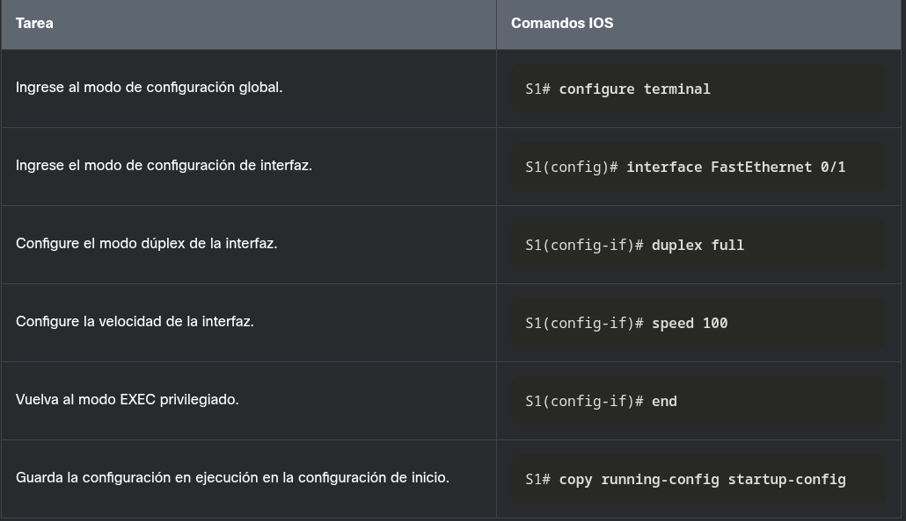

---
### COMUNICACIÓN DUPLEX

**Dúplex Completo (Full-Duplex)**

**Bidireccional:** Transmite y recibe datos simultáneamente.

**Microsegmentación:** Funciona cuando hay un solo dispositivo conectado al puerto del switch.

**Cero colisiones:** Al no haber dominio de colisión en el puerto, el circuito de detección de colisiones de la NIC se desactiva.

**Eficiencia máxima:** Ofrece 100% de eficacia en transmisión y recepción, lo que duplica el ancho de banda potencial.

**Requisito de hardware:** Obligatorio para que funcionen las conexiones Gigabit Ethernet y las NIC de 10 Gb. Es el estándar actual.

**Semidúplex (Half-Duplex)**

**Unidireccional:** Los datos solo pueden fluir en una dirección a la vez.

**Problemas de red:** Genera cuellos de botella en el rendimiento y provoca colisiones.

**Uso actual:** Prácticamente obsoleto; se encuentra principalmente en hardware antiguo (como los hubs).

----
### CONFIGURACIÓN DE PUERTOS DE SWITCH DE LA CAPA FISICA

La tabla muestra los comandos para S1. Los mismos comandos se pueden aplicar a S2.

---

**Configuración Manual de Dúplex y Velocidad**

**Comandos de Configuración (Modo de Interfaz)**

**Dúplex:** Se usa el comando `duplex`.

**Velocidad:** Se usa el comando `speed`.

---

**Comportamiento de los Puertos (ej. Cisco Catalyst 2960/3560)**

**Por defecto:** Vienen configurados en modo automático (autonegociación).

**A 10 o 100 Mbps:** Pueden funcionar tanto en semidúplex como en dúplex completo.

**A 1000 Mbps (1 Gbps):** Operan _exclusivamente_ en dúplex completo.

**Puertos de Fibra Óptica (ej. 1000BASE-SX):** Siempre trabajan a una velocidad fija y obligatoriamente en dúplex completo.

---

**Mejores Prácticas de Implementación**

**Dejar en Automático:** Útil solo para puertos donde se conectan dispositivos desconocidos o que cambian constantemente.

**Configuración Manual:** Es el estándar recomendado para infraestructura dedicada y conocida (servidores, otros switches, routers, estaciones de trabajo).

---

**Solución de Problemas (Troubleshooting)**

Las incompatibilidades entre la velocidad o el dúplex de dos dispositivos conectados causan **problemas de conectividad** y pérdida de rendimiento.

Estos errores suelen ser producto de fallas en el protocolo de autonegociación, por lo que verificar manualmente estas configuraciones es el primer paso al diagnosticar el puerto de un switch.

---
### AUTO - MDIX 

**Función:** Detecta automáticamente el tipo de cable Ethernet conectado (directo o cruzado) y ajusta la configuración de la interfaz internamente para establecer la conexión sin importar el cable.

**Reglas clásicas (sin Auto-MDIX):**

**Cable Directo:** Switch a servidor, estación de trabajo (PC) o router.

**Cable Cruzado:** Switch a switch o a repetidor.

>**Requisito esencial:** Para que la característica Auto-MDIX funcione de manera correcta, tanto la **velocidad (speed)** como el **dúplex (duplex)** del puerto deben estar configurados en modo **automático** (`auto`).

>**Disponibilidad:** Viene habilitado de forma predeterminada en switches más nuevos (como Catalyst 2960 y 3560). No está disponible en modelos antiguos (Catalyst 2950 y 3550).

**Habilitar la función:** Se utiliza el comando `mdix auto` dentro del modo de configuración de la interfaz.

**Verificar el estado:** Para comprobar si la función está activa (_On_) o inactiva (_Off_) en un controlador específico, se utiliza el siguiente comando con un filtro: `show controllers ethernet-controller [interfaz] phy | include Auto-MDIX`

---
### COMANDOS DE VERIFICACIÓN DE SWITCH

| **Tarea**                                                 | **Comandos IOS**                                                                                                                |
| --------------------------------------------------------- | ------------------------------------------------------------------------------------------------------------------------------- |
| Muestra el estado y la configuración de la interfaz.      | `S1# show interfaces [interface-id]`                                                                                            |
| Muestra la configuración de inicio actual.                | `S1# show startup-config`                                                                                                       |
| Muestra la configuración actual en ejecución.             | `S1# show running-config`                                                                                                       |
| Muestra información sobre el sistema de archivos flash.   | `S1# show flash`                                                                                                                |
| Muestra el estado del hardware y el software del sistema. | `S1# show version`                                                                                                              |
| Muestra el historial de comandos ingresados.*             | `S1# show history`                                                                                                              |
| Muestra información de IP de una interfaz.                | `S1# show ip interface [interface-id]`         O         `S1# show ipv6 interface [interface-id]` |
| Muestra la tabla de direcciones MAC.                      | `S1# show mac-address-table`         O         `S1# show mac address-table`                       |

----
### VERIFICAR  LA CONFIGURACIÓN DE PUERTOS DEL SWITCH

El comando **show running-config** se puede usar para verificar que el switch se haya configurado correctamente. De la salida abreviada de muestra en S1, se muestra alguna información importante en la figura:

>La interfaz Fast Ethernet 0/18 se configura con la VLAN de administración 99

  >La VLAN 99 está configurada con una dirección IPv4 de 172.17.99.11 255.255.255.0
  
  >La puerta de enlace predeterminada está establecida en 172.17.99.1
  

El comando **show interfaces** es otro comando de uso común, que muestra información de estado y estadísticas en las interfaces de red del switch. El comando **show interfaces** se usa con frecuencia al configurar y monitorear dispositivos de red.

La primera línea de salida para el comando **show interfaces fastEthernet 0/18** indica que la interfaz FastEthernet 0/18 está activa / activa, lo que significa que está operativa. Más abajo en el resultado, se muestra que el modo dúplex es full (completo) y la velocidad es de 100 Mb/s.

----
### PROBLEMAS DE LA CAPA DE ACCESO A LA RED.

El comando fundamental para detectar problemas en los medios físicos y de enlace de datos es `show interfaces`. La lectura de su salida se divide en dos indicadores principales:

**Capa 1 (Hardware / Física):** El primer parámetro (ej. `FastEthernet0/18 is up`) indica si la interfaz está recibiendo una señal de detección de portadora.

**Capa 2 (Enlace de datos):** El segundo parámetro (ej. `line protocol is up`) indica si se están recibiendo los _keepalives_ del protocolo de capa de enlace.

### Diagnóstico rápido de estados (Status/Protocol)

Dependiendo de la combinación de estos dos parámetros, puedes aislar el fallo inmediatamente:

>**Up / Down (Activa / Inactivo):** Existe un problema de hardware, la interfaz remota está inhabilitada por errores, o hay una incompatibilidad en el tipo de encapsulación.

>**Down / Down (Inactiva / Inactivo):** Capa física rota. No hay un cable conectado o el extremo remoto está administrativamente inactivo.

>**Administratively down:** La interfaz fue deshabilitada manualmente por un administrador usando el comando `shutdown`.

### Análisis de Estadísticas y Contadores de Error

El comando `show interfaces` también expone contadores que revelan problemas de rendimiento que, aunque no boten la conexión, degradan la red.

| **Tipo de error**                        | **Descripción y Causa**                                                                                                                                                                                                                                                                                               |
| ---------------------------------------- | --------------------------------------------------------------------------------------------------------------------------------------------------------------------------------------------------------------------------------------------------------------------------------------------------------------------- |
| **Errores de entrada (Input errors)**    | Es la sumatoria total de errores recibidos. Incluye runts, gigantes, CRC, sin buffer, desbordamiento y recuentos ignorados.                                                                                                                                                                                           |
| **Fragmentos de colisión (Runts)**       | Paquetes descartados por ser inferiores al tamaño mínimo permitido en el medio (menos de 64 bytes para Ethernet). La causa habitual es una **tarjeta de red (NIC) defectuosa** o un exceso de colisiones.                                                                                                             |
| **Gigantes (Giants)**                    | Paquetes descartados por exceder el tamaño máximo permitido (más de 1.518 bytes en Ethernet estándar).                                                                                                                                                                                                                |
| **CRC**                                  | Fallo de integridad. La suma de comprobación (checksum) calculada localmente no coincide con la recibida en la trama. Casi siempre indica un **problema físico en el cable** (interferencia eléctrica, conectores flojos, cables dañados o mucho ruido en el entorno).                                                |
| **Errores de salida (Output errors)**    | Sumatoria de todos los errores internos que impidieron la transmisión final del datagrama por la interfaz.                                                                                                                                                                                                            |
| **Colisiones (Collisions)**              | Cantidad de mensajes que tuvieron que ser retransmitidos debido a una colisión en el segmento Ethernet. Son normales en half-duplex, pero **jamás** deberías verlas en una interfaz configurada en full-duplex.                                                                                                       |
| **Colisiones tardías (Late collisions)** | Anomalía grave donde la colisión ocurre después de que ya se han transmitido los primeros 512 bits de la trama. Sus dos causas principales: **cables demasiado largos** (excediendo la distancia permitida) o una **incompatibilidad de dúplex** (un extremo del cable está en full-duplex y el otro en half-duplex). |

---

### RESOLUCIÓN DE PROBLEMAS DE LA CAPA DE ACCESO A RED

La mayoría de los problemas en redes conmutadas se producen durante la implementación inicial, aunque el mantenimiento y la resolución de fallos son tareas permanentes debido a cables que se dañan, cambios de configuración o la adición de nuevos dispositivos.

El flujo de trabajo básico para diagnosticar un puerto comienza utilizando el comando `show interfaces` para verificar su estado actual.

>**Escenario A: La interfaz está Inactiva (Down)**

Verifica que se estén usando los cables correctos, revisa si hay daños físicos y reemplaza el cable si sospechas que está defectuoso.

Si la interfaz continúa inactiva tras revisar la capa física, el problema suele ser una incompatibilidad en la velocidad. Para resolverlo, establece manualmente la misma configuración de velocidad en ambos extremos del enlace.

>**Escenario B: La interfaz está Activa (Up) pero hay problemas de conectividad**

Revisa los contadores del comando `show interfaces` en busca de ruido excesivo, indicado por un aumento en fragmentos de colisión (runts), gigantes o errores CRC. Si encuentras ruido, elimina la fuente de interferencia, verifica el tipo de cable y asegúrate de que no exceda la longitud máxima.

Si no hay ruido pero observas colisiones normales o colisiones tardías (aquellas que ocurren después de transmitir 512 bits de la trama), el problema es una incompatibilidad en la configuración de dúplex. Para solucionarlo, configura manualmente el modo `full` (dúplex completo) en ambos extremos de la conexión.

----

