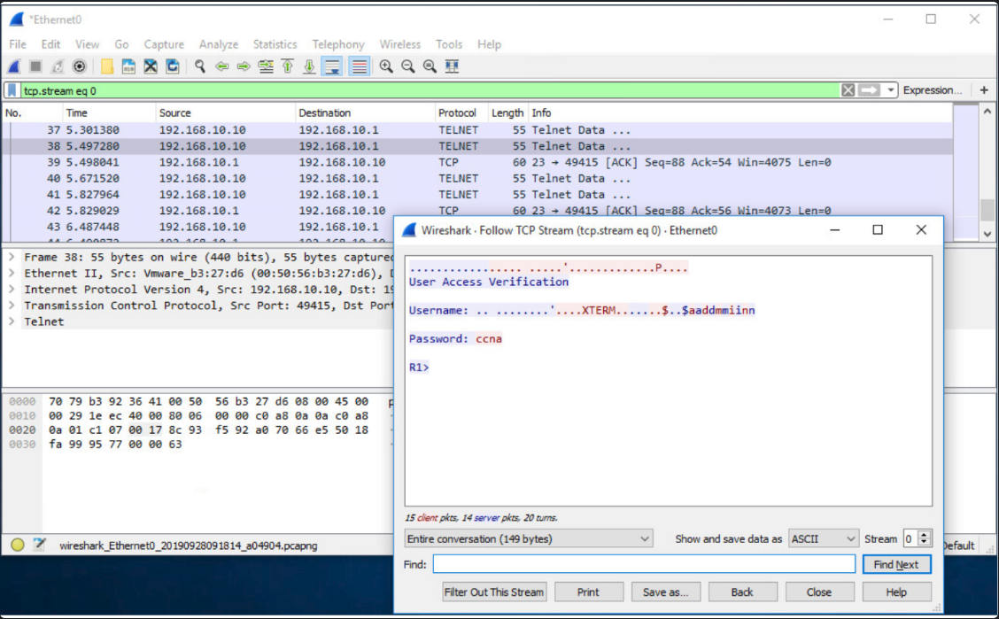

---
### OPERACIÓN TELNET

**Acceso Remoto Seguro ( SSH vs. Telnet)**

Para administrar un switch cuando no se tiene acceso físico a él, es obligatorio utilizar protocolos de acceso remoto seguros.

**Telnet (Inseguro - No recomendado)**

**Protocolo:** Utiliza el puerto TCP 23.

**Vulnerabilidad crítica:** Es un protocolo antiguo que transmite toda la información en **texto plano** (sin cifrar), incluyendo la autenticación (nombre de usuario y contraseña) y los datos de configuración.

**Riesgo:** Un atacante en la red puede utilizar herramientas de captura de tráfico (como Wireshark) para interceptar y leer los paquetes, comprometiendo fácilmente las credenciales del equipo.



**Secure Shell - SSH (El estándar seguro)**

**Solución:** Es el protocolo que se debe configurar de manera imperativa para la administración remota, ya que cifra de manera segura toda la sesión de comunicación, impidiendo la lectura de los datos interceptados.

----
### FUNCIONAMIENTO DE SSH

**Secure Shell (SSH)** es el protocolo de administración remota estándar que debe reemplazar obligatoriamente a Telnet, operando a través del puerto **TCP 22** para establecer una conexión fuertemente cifrada. Su principal ventaja es que proporciona protección total al encriptar tanto la fase de autenticación (nombre de usuario y contraseña) como todos los datos transmitidos durante la sesión, lo que garantiza que si el tráfico de red es interceptado con herramientas de monitoreo como Wireshark, la información capturada resulte completamente ilegible.


**Verifique que el switch admita SSH**

Para habilitar SSH en un switch Catalyst 2960, el switch debe usar una versión del software IOS que incluya características y capacidades criptográficas (cifradas). Utilice el comando **show version** del switch para ver qué IOS está ejecutando el switch. Un nombre de archivo de IOS que incluye la combinación «k9» admite características y capacidades criptográficas (cifradas). El ejemplo muestra la salida del comando **show version**.


---
### CONFIG DE SSH

Antes de configurar SSH, el switch debe tener configurado, como mínimo, un nombre de host único y los parámetros correctos de conectividad de red.

**Paso 1: Verifique support SSH.**

Use el comando **show ip ssh** para verificar que el switch sea compatible con SSH. Si el switch no ejecuta un IOS que admita características criptográficas, este comando no se reconoce.


---

**Paso 2: Configure el IP domain.**

Configure el nombre de dominio IP de la red utilizando el comando **ip domain-name** _domain-name_ modo de configuración global. En la figura, el valor _domain-name_ es **[cisco.com](http://cisco.com/)**.

```
S1(config)# ip domain-name cisco.com
```

---

**Paso 3: Genere un par de claves RSA.**

No todas las versiones del IOS utilizan la versión 2 de SSH de manera predeterminada, y la versión 1 de SSH tiene fallas de seguridad conocidas. Para configurar SSH versión 2, emita el comando del modo de configuración global **ip ssh version 2**. La creación de un par de claves RSA habilita SSH automáticamente. Use el comando del modo de configuración global **crypto key generate rsa**, para habilitar el servidor SSH en el switch y generar un par de claves RSA. Al crear claves RSA, se solicita al administrador que introduzca una longitud de módulo. La configuración de ejemplo en la figura 1 utiliza un tamaño de módulo de 1024 bits. Una longitud de módulo mayor es más segura, pero se tarda más en generarlo y utilizarlo.

**Nota:** Para eliminar el par de claves RSA, use el comando del modo de configuración global **crypto key zeroize rsa**. Después de eliminarse el par de claves RSA, el servidor SSH se deshabilita automáticamente.

```
S1(config)# crypto key generate rsa
How many bits in the modulus [512]: 1024
```

----

**Paso 4: Configure autenticación de usuarios.**

El servidor SSH puede autenticar a los usuarios localmente o con un servidor de autenticación. Para usar el método de autenticación local, cree un par de nombre de usuario y contraseña con el comando **username** _username_ **secret** _password_ modo de configuración global. En el ejemplo, se asignó la contraseña ccna al usuario admin.

```
S1(config)# username admin secret ccna
```

---

**Paso 5: Configure las lineas vty.**

Habilite el protocolo SSH en las líneas vty utilizando el comando del modo de configuración de línea **transport input ssh**. El switch Catalyst 2960 tiene líneas vty que van de 0 a 15. Esta configuración evita las conexiones que no son SSH (como Telnet) y limita al switch a que acepte solo las conexiones SSH. Use el comando **line vty** del modo de configuración global y luego el comando **login local** del modo de configuración de línea para requerir autenticación local para las conexiones SSH de la base de datos de nombre de usuario local.

```
S1(config)# line vty 0 15
S1(config-line)# transport input ssh
S1(config-line)# login local
S1(config-line)# exit
```

---

**Paso 6: Habilite SSH versión 2.**

De manera predeterminada, SSH admite las versiones 1 y 2. Al admitir ambas versiones, esto se muestra en la salida **show ip ssh** como compatible con la versión 2. Habilite la versión SSH utilizando el comando de configuración global **ip ssh version 2**.

```
S1(config)# ip ssh version 2
```

----
### VERIFIQUE DE SSH ESTE ACTIVO

En las computadoras se usa un cliente SSH, como PuTTY, para conectarse a un servidor SSH. Por ejemplo, suponga que se configura lo siguiente:

>SSH está habilitado en el interruptor S1

>Interfaz VLAN 99 (SVI) con la dirección IPv4 172.17.99.11 en el switch S1.

>PC1 con la dirección IPv4 172.17.99.21.

La figura muestra la configuración de PuTTy para PC1 para iniciar una conexión SSH a la dirección SVI VLAN IPv4 de S1.


Cuando está conectado, se solicita al usuario un nombre de usuario y una contraseña como se muestra en el ejemplo. Usando la configuración del ejemplo anterior, se ingresan el nombre de usuario: **admin** y la contraseña: **ccna** Después de ingresar la combinación correcta, el usuario se conecta a través de SSH a la interfaz de línea de comando (CLI) en el switch Catalyst 2960.


Para mostrar los datos de la versión y de configuración de SSH en el dispositivo que configuró como servidor SSH, use el comando **show ip ssh**. En el ejemplo, se habilitó la versión 2 de SSH.


---

