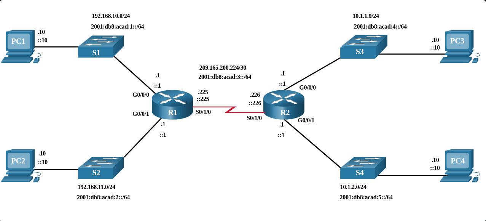

---

### CONFIG BÁSICA DE UNA ROUTER

**Propósito Principal:** Mientras que los switches operan a nivel local, los routers son obligatorios para enrutar el tráfico y permitir que los dispositivos se comuniquen **fuera de su red local**.

**Similitud con Switches:** Los routers y switches de Cisco comparten el mismo tipo de sistema operativo, estructura de modos y comandos.

**Configuración Inicial:** Los primeros pasos de despliegue son exactamente los mismos que en un switch (por ejemplo, asignar un nombre al dispositivo para identificarlo en la red y establecer contraseñas de seguridad).

Configure un banner para proporcionar notificaciones legales de acceso no autorizado, como se muestra en el ejemplo.

Guarde los cambios en un router, como se muestra en el ejemplo.

---
### TOPOLOGÍAS DE DOBLE PILA

Una característica que distingue a los switches de los routers es el tipo de interfaces que admite cada uno. Por ejemplo, los switches de capa 2 admiten LAN; por lo tanto, tienen múltiples puertos FastEthernet o Gigabit Ethernet. La topología de pila dual de la figura se utiliza para demostrar la configuración de las interfaces IPv4 e IPv6 del router.

---
### CONFIGURAR INTERFACES DE ROUTERS

Los routers utilizan múltiples tipos de interfaces (como Gigabit Ethernet integradas o tarjetas modulares HWIC para enlaces Seriales, DSL, etc.) para interconectar diferentes redes LAN y WAN.

Para que una interfaz esté completamente operativa, se deben cumplir los siguientes parámetros en su modo de configuración:

**Direccionamiento IP:** Es obligatorio asignar al menos una dirección lógica utilizando los comandos `ip address [ip] [máscara]` para IPv4 y/o `ipv6 address [ipv6/prefijo]` para IPv6.

**Activación Lógica:** A diferencia de los switches, las interfaces del router vienen apagadas por defecto (`shutdown`). Deben encenderse manualmente con el comando `no shutdown`.

**Nota**: La capa física solo se activará si hay un cable conectado a un dispositivo remoto encendido.

**Descripción (Mejor Práctica):** Se asigna mediante el comando `description [texto]` (hasta 240 caracteres). Aunque es opcional, es vital en redes de producción para documentar a qué está conectado ese puerto, facilitando enormemente el troubleshooting futuro.

El siguiente ejemplo muestra la configuración de las interfaces en R1.

---

### INTERFACES DE LOOPBACK (DOBLE BUCLE)

Es una interfaz 100% virtual (software) interna del router. No está atada a ningún puerto físico ni hardware externo.

Al no depender de cables, siempre permanece en estado activo (`Up`) mientras el sistema operativo del router esté en funcionamiento.

Esta garantiza que el dispositivo siempre tenga al menos una dirección IP disponible y estable para acceder a él, inmune a fallos de puertos físicos.

Permite emular redes adicionales (como simular un enlace a Internet o redes detrás del router) para probar procesos de enrutamiento sin necesidad de hardware extra.

El proceso de habilitación y asignación de una dirección de loopback es simple:

Se pueden habilitar varias interfaces loopback en un router. La dirección IPv4 para cada interfaz de bucle invertido debe ser única y no debe ser utilizada por ninguna otra interfaz, como se muestra en la configuración de ejemplo de la interfaz de bucle invertido 0 en R1.

----

