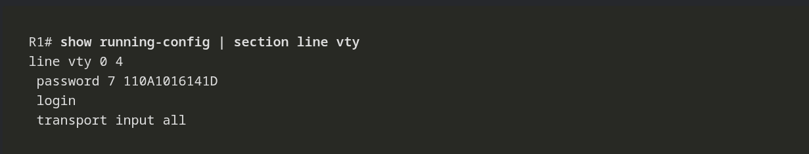

---

Para auditar rápidamente el estado operativo, el direccionamiento y el enrutamiento de las interfaces en un router, esta es la trinidad de comandos esenciales:

`show ip interface brief` / `show ipv6 interface brief`: El comando de reconocimiento por excelencia. Despliega un mapa condensado de todas las interfaces, sus direcciones asignadas y sus estados de capa 1 y 2 (Up/Down).

`show running-config interface [interface-id]`: Aísla la configuración activa. Filtra y muestra exclusivamente los comandos aplicados a un puerto específico, ideal para aislar errores de sintaxis sin tener que leer toda la configuración global.

`show ip route` / `show ipv6 route`: Despliega la tabla de enrutamiento almacenada en la RAM. Es la prueba definitiva de que la interfaz está operando en la capa de red:

>**En Cisco IOS 15:** Toda interfaz activa inyecta automáticamente dos rutas: una identificada con **'C'** (Red Conectada directamente) y otra con **'L'** (Dirección Local/Host de la interfaz).

>**En versiones Legacy:** Solo se inyecta la entrada con el código **'C'**.

---
### FILTRADO DE LOS RESULTADOS DEL COMANDO SHOW

(Debemos usar la tuberia | junto con el comando show para que pueda funcionar)

**Section**: Muestra la sección completa que comienza con la expresión de filtrado.

**Include**: Incluye todas las lineas de salidad que coinciden con la expresión del filtrado.

**Exclude**: Excluye todas las lineas de salidad que coinciden con la expresión del filtrado.

**Begin**: Selecciona todas las lineas desde un punto determinado hacia adelante, comenanzando con la linea que coincide con lo que queremos buscar.

---
### HISTORIAL DE COMANDOS.

El búfer del historial de comandos en Cisco IOS captura por defecto las últimas 10 líneas ejecutadas, permitiendo navegar ágilmente por ellas mediante las teclas de dirección (**Arriba/Abajo**) o los atajos **Ctrl+P** / **Ctrl+N** para agilizar la administración y evitar la reescritura manual en la terminal. Todo el contenido almacenado se puede auditar con el comando `show history`, y si la sesión operativa exige despliegues de configuración más extensos, la capacidad de este registro puede modificarse dinámicamente ejecutando `terminal history size`.

----

