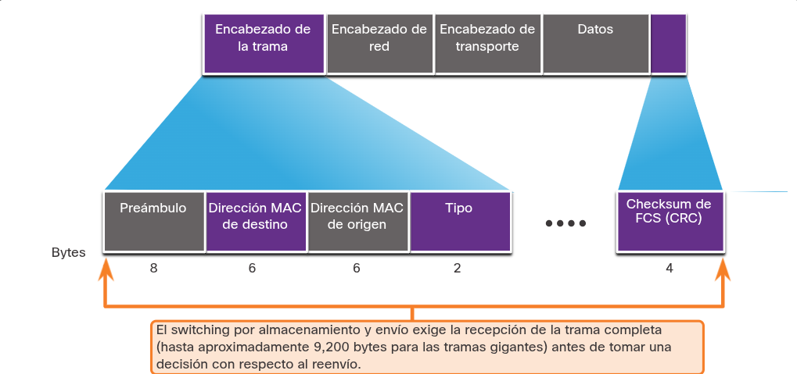

---

### SWITCHING EN LA RED

El switching en redes LAN se basa en la capacidad del dispositivo para reenviar tramas Ethernet utilizando una única tabla de direcciones MAC. Cuando una trama ingresa al dispositivo (puerto de **entrada**), el switch lee su dirección MAC de destino y consulta su tabla interna para determinar por qué puerto exacto debe abandonarlo (puerto de **salida**). Esta asociación estricta entre MACs y puertos garantiza que el tráfico hacia un destino específico siempre se enrute correctamente, respetando una regla de oro inquebrantable: una trama jamás será reenviada de regreso por el mismo puerto por el que acaba de ingresar.

---

### TABLA DE DIRECCIONES MAC DE SWITCH

Para dirigir el tráfico correctamente, un switch LAN construye dinámicamente una **tabla de direcciones MAC** (también conocida como **tabla CAM**, por almacenarse en la _Content-Addressable Memory_ para búsquedas de alta velocidad). El dispositivo llena esta tabla leyendo y registrando la dirección MAC de **origen** de cada trama que ingresa a sus puertos; posteriormente, consulta esta misma tabla evaluando la dirección MAC de **destino** de las nuevas tramas entrantes para reenviarlas de forma exacta por el puerto de salida asignado a ese dispositivo.

---

### EL MÉTODO DE APRENDER Y REENVIAR DEL SWITCH

El siguiente proceso de dos pasos se realiza para cada trama de Ethernet que ingresa a un switch.

**Paso 1. Aprender - Examinando la dirección Origen MAC**

Se revisa cada trama que ingresa a un switch para obtener información nueva. Esto se realiza examinando la dirección MAC de origen de la trama y el número de puerto por el que ingresó al switch.

Si la dirección MAC de origen no existe en la tabla de direcciones MAC, la dirección MAC y el número de puerto entrante son agregados a la tabla.

Si la dirección MAC de origen existe, el switch actualiza el temporizador para esa entrada. De manera predeterminada, la mayoría de los switches Ethernet guardan una entrada en la tabla durante cinco minutos. Si la dirección MAC de origen existe en la tabla, pero en un puerto diferente, el switch la trata como una entrada nueva. La entrada se reemplaza con la misma dirección MAC, pero con el número de puerto más actual.

**Paso 2. Reenviar - Examinadno la dirección destino MAC**

Si la dirección MAC de destino es una dirección de unidifusión, el switch busca una coincidencia entre la dirección MAC de destino de la trama y una entrada de la tabla de direcciones MAC:

Si la dirección MAC de destino está en la tabla, reenviará la trama por el puerto especificado.

Si la dirección MAC de destino no está en la tabla, el switch reenviará la trama por todos los puertos, excepto por el de entrada. Esto se conoce como unidifusión desconocida. Si la dirección MAC de destino es de difusión o de multidifusión, la trama también se envía por todos los puertos, excepto por el de entrada.

---

### MÉTODOS DE REENVIO DE SWITCHES 

Los switches toman decisiones de Capa 2 a altísima velocidad sin degradar el rendimiento gracias al uso de los **ASIC** (Circuitos Integrados de Aplicación Específica), que son chips de hardware dedicados exclusivamente al procesamiento rápido de paquetes.

Para procesar estas tramas, utilizan uno de dos métodos:

**Almacenamiento y reenvío (Store-and-forward):** El switch recibe la trama _completa_ en su búfer, verifica que no tenga defectos mediante una operación matemática de control de errores (CRC) y, si está sana, la reenvía. Es el método principal y estándar en los switches Cisco.

**Método de corte (Cut-through):** Prioriza la velocidad. El proceso de reenvío comienza en el instante exacto en que el switch lee la dirección MAC de destino y determina el puerto de salida, sin esperar a recibir el resto de la trama ni comprobar si tiene errores.

---
### INTERCAMBIO DE ALMACENAMIENTO Y REENVIO

Este método de switching se diferencia del método de corte por dos características técnicas fundamentales que garantizan la integridad y flexibilidad del tráfico:

**Verificación de errores (FCS):** El switch exige recibir la trama en su totalidad antes de tomar cualquier acción. Una vez recibida, realiza un cálculo matemático (Secuencia de Verificación de Trama o FCS) y lo compara con el de la trama para asegurar que no haya sufrido errores físicos ni de enlace. Si la trama está corrupta, se descarta inmediatamente; si está intacta, se reenvía.

**Almacenamiento en búfer automático:** Esta función es vital para conectar puertos que operan a distintas velocidades (por ejemplo, recibir desde un puerto a 100 Mbps y enviar por uno a 1 Gbps). El switch guarda temporalmente la trama completa en su búfer, realiza la validación de errores y luego la transfiere al búfer de salida para ser transmitida a la nueva velocidad requerida.

La figura ilustra cómo almacenar y reenviar toma una decisión basada en la trama Ethernet.

---
### SWITCHING POR MÉTODO DE CORTE

El método de corte (_cut-through_) prioriza la velocidad extrema al reenviar la trama en el instante en que lee su dirección MAC de destino, sin esperar a recibirla completa ni realizar comprobaciones de errores (FCS). Aunque ofrece una latencia ultrabaja ideal para aplicaciones de alto rendimiento, corre el riesgo de propagar tramas corruptas que saturan la red; para mitigar esto, su variante "libre de fragmentos" lee una pequeña porción adicional de los datos iniciales (hasta el campo Tipo), logrando un mejor filtrado de errores básicos sin sacrificar rapidez.

---

