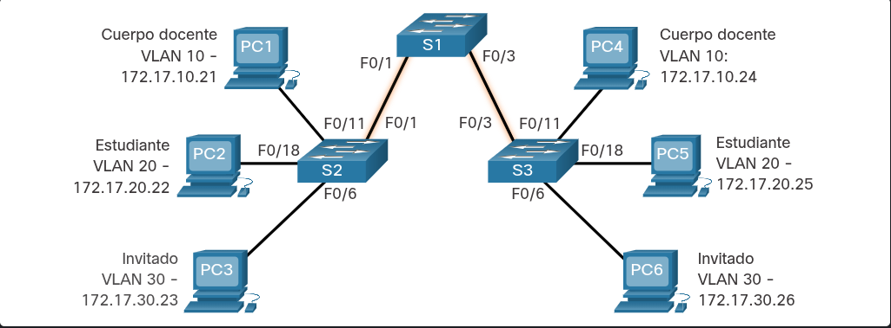
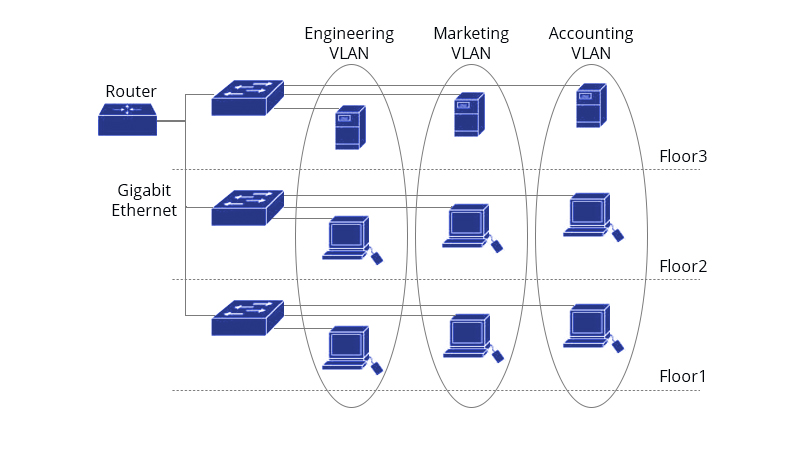
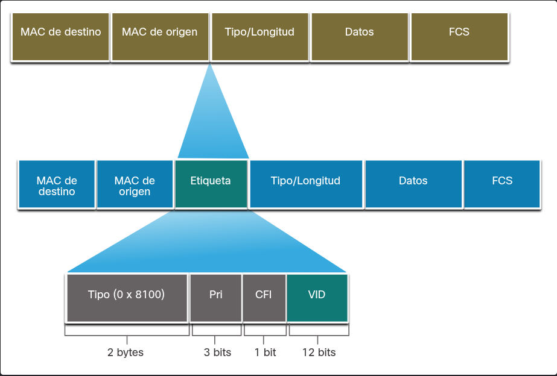

---
### DEFINICIÓN DE TRONCOS EN LA VLAN

**¿Qué es?:** Un enlace punto a punto entre dispositivos diseñado para transportar **más de una VLAN** a la vez.

**Propósito:** Permite que equipos en la misma VLAN, pero en switches diferentes, se comuniquen directamente **sin necesidad de un router**.

**Protocolo:** Utiliza el estándar **IEEE 802.1Q** para coordinar el tráfico etiquetado.

**Regla clave:** Un enlace troncal **no pertenece a ninguna VLAN específica**, es solo un conducto. Por defecto, los switches Cisco Catalyst permiten el paso de todas las VLAN por estos puertos.

_Como se ve en la ilustración, los enlaces troncales entre los switches S1, S2 y S3 son indispensables para transmitir el tráfico de las VLAN 10, 20, 30 y 99 a través de toda la red:_

---
### REDES SIN VLAN

En una red configurada en una única subred sin la implementación de VLANs, toda la infraestructura opera de forma plana como un único gran dominio de difusión. Debido a que el comportamiento predeterminado de un switch es reenviar cualquier trama de difusión recibida por todos sus puertos (excepto por el de entrada), cualquier difusión generada por un solo dispositivo inundará obligatoriamente a todos los demás equipos conectados, generando tráfico innecesario y reduciendo el rendimiento general de la red por falta de segmentación lógica.

### REDES CON VLAN 

Al implementar VLANs para segmentar una red, se crean dominios de difusión completamente aislados. Cuando un dispositivo envía una trama de difusión de Capa 2, el switch restringe su reenvío exclusivamente a los puertos configurados para esa misma VLAN. Aunque los enlaces troncales transportan el tráfico de todas las VLAN entre los distintos switches de la infraestructura, cada switch intermedio respeta esta segmentación, asegurando que la difusión llegue únicamente a los destinatarios correctos. En consecuencia, el uso de VLANs limita estrictamente la transmisión de cualquier tráfico de unidifusión, multidifusión o difusión a los dispositivos que pertenecen a esa red lógica en particular.

---
### IDENTIFICACIÓN DE VLAN CON ETIQUETA

**El proceso de etiquetado (Tagging)**

Dado que el encabezado Ethernet estándar no contiene información sobre la VLAN, es indispensable agregar estos datos cuando las tramas viajan a través de un enlace troncal.

Este proceso se realiza mediante el estándar **IEEE 802.1Q**, el cual inserta una etiqueta de **4 bytes** directamente en el encabezado de la trama Ethernet original para identificar su VLAN.

Cuando un switch recibe una trama normal en un puerto de acceso, inserta esta etiqueta 802.1Q, **vuelve a calcular la Secuencia de Verificación de Tramas (FCS)** (para asegurar la integridad de los datos alterados) y finalmente envía la trama etiquetada por el puerto troncal.

**Estructura de la etiqueta VLAN (4 bytes)** La etiqueta insertada consta de cuatro campos específicos:

**Tipo (TPID - ID de Protocolo de Etiqueta):** Valor de 2 bytes. En Ethernet, este valor siempre se establece en el formato hexadecimal **0x8100**.

**Prioridad de usuario:** Valor de 3 bits que admite la implementación de niveles o clases de servicio (QoS).

**Identificador de Formato Canónico (CFI):** Identificador de 1 bit que permite transportar tramas Token Ring a través de los enlaces Ethernet.

**VLAN ID (VID):** Número de identificación de 12 bits que define a qué VLAN pertenece la trama. Gracias a estos 12 bits, la red admite hasta **4096** IDs de VLAN diferentes.

### VLAN nativas y etiquetado de 802.1Q

**Tráfico sin etiqueta (Untagged):** Cualquier trama que llegue sin etiqueta a un enlace troncal 802.1Q se envía automáticamente a la **VLAN nativa** (definida por el PVID, que por defecto es la VLAN 1).

**Regla de descarte (Cisco):** Si el switch recibe una trama etiquetada con el **mismo ID** que su VLAN nativa, **la descarta** inmediatamente.

**Otros fabricantes:** Dispositivos que no son Cisco (teléfonos IP, servidores) sí podrían enviar tráfico etiquetado por la VLAN nativa, así que tenlo en cuenta al mezclar equipos.

### Caso práctico: Host en un enlace troncal (Diseño deficiente)

**Comportamiento del tráfico:** Si un host (como PC1) se conecta a un enlace troncal usando un hub, enviará datos sin etiquetar. Los switches asocian automáticamente ese tráfico a la VLAN nativa y lo reenvían al resto de la red.

**Problema de comunicación:** Cuando la PC1 recibe tráfico de regreso etiquetado desde el enlace troncal, simplemente lo descarta porque no comprende las etiquetas 802.1Q.

**Propósito real:** Conectar hosts a troncales o usar hubs es un diseño de red deficiente. Sin embargo, este escenario ilustra por qué existe la VLAN nativa en el estándar 802.1Q: se creó como un medio para mantener la compatibilidad y manejar estos "entornos antiguos" o heredados.

---
### ETIQUETADO DE VLAN DE VOZ

**VLAN dedicada:** VoIP requiere una VLAN separada exclusivamente para poder aplicar políticas de seguridad y **Calidad de Servicio (QoS)**.

**Enlace tipo troncal:** Un teléfono IP de Cisco se conecta al switch y la PC se conecta al teléfono. Este puerto del switch actúa como un troncal, ya que se configura para manejar dos VLANs simultáneas: la de voz (para el teléfono) y la de datos (para la PC).

**Switch integrado:** El teléfono IP tiene un pequeño switch interno de 3 puertos:

Enlace hacia el switch principal de la red.

Interfaz interna que procesa el tráfico del propio teléfono.

Puerto de acceso donde se conecta la PC.

**Uso de CDP:** El switch principal envía paquetes CDP al teléfono para indicarle cómo debe mandar el tráfico. Las tres formas de enviarlo son:

Etiquetado en la VLAN de voz con prioridad CoS (Capa 2).

Etiquetado en la VLAN de acceso (datos) con prioridad CoS.

Sin etiquetar en la VLAN de acceso (sin prioridad CoS).

---

### Ejemplo de verificación de VLAN de voz

**Comando clave:** Utiliza `show interface [interfaz] switchport` (por ejemplo, `show interface fa0/18 switchport`) para verificar la configuración.

**Propósito:** Este comando te permite confirmar rápidamente que un mismo puerto tiene asignadas correctamente las dos VLANs de manera simultánea: la VLAN para datos (ej. VLAN 20) y la VLAN para voz (ej. VLAN 150).

----
