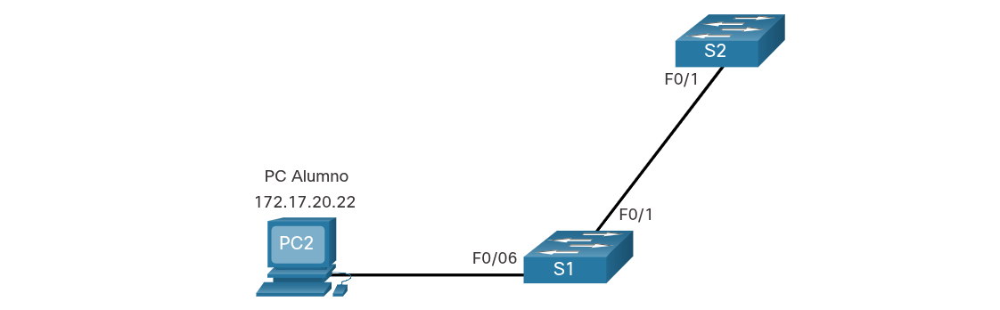
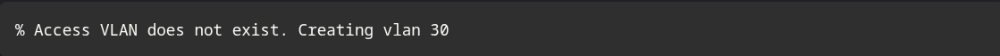

---
### RANGOS DE VLAN EN LOS SWITCHES CATALYST 

**Capacidad total:** Los switches Cisco Catalyst (como las series 2960 y 3560) admiten más de 4000 VLANs.

**VLAN de rango normal:** Se numeran del **1 al 1005**.

**VLAN de rango extendido:** Se numeran del **1006 al 4094**.

### Características de las VLAN de rango normal y extendido

**Rango Normal (ID del 1 al 1005)**

**Escenario de uso:** Pequeñas, medianas empresas y negocios corporativos estándar.

**Almacenamiento:** Se guardan en el archivo de base de datos **`vlan.dat`** alojado en la memoria flash.

**Restricciones:** Las ID 1 y del 1002 al 1005 (reservadas para Token Ring y FDDI) vienen por defecto, no se pueden eliminar ni modificar.

**VTP (VLAN Trunking Protocol):** Admite la sincronización automática de esta base de datos entre los distintos switches de la red.

**Rango Extendido (ID del 1006 al 4094)**

**Escenario de uso:** Proveedores de servicios de Internet (ISP) y redes empresariales globales masivas.

**Almacenamiento:** A diferencia de las normales, estas se guardan en el archivo de configuración en ejecución (**`running-config`**).

**Restricciones:** Soportan menos características operativas que las de rango normal.

**VTP:** Para poder configurar VLANs extendidas, es obligatorio que el VTP esté configurado en **modo transparente**.

**Dato técnico:** El tope absoluto de VLANs posibles en un switch Catalyst es de **4096**. Esto se debe a que el campo "VLAN ID" dentro del encabezado de la trama IEEE 802.1Q ocupa exactamente **12 bits** ($2^{12} = 4096$).

----
### COMANDOS DE CONFIG PARA VLAN

La configuración de las VLAN de rango normal se guarda directamente en el archivo `vlan.dat` dentro de la memoria flash del switch.

**Persistencia y guardado:** La memoria flash es persistente, por lo que la creación de la VLAN por sí sola no exige ejecutar el comando `copy running-config startup-config`. Sin embargo, es una **práctica recomendada** hacerlo siempre, ya que normalmente la creación de VLANs viene acompañada de otros cambios en la configuración en ejecución.

**Buena práctica:** Al momento de agregar una VLAN mediante la interfaz de línea de comandos (CLI), siempre se recomienda asignarle un nombre descriptivo para facilitar la gestión y solución de problemas en la red.

---
### Ejemplo de creación de VLAN

En el ejemplo de topología, la computadora del estudiante (PC2) todavía no se asoció a ninguna VLAN, pero tiene la dirección IP 172.17.20.22, que pertenece a la VLAN 20.

En la figura, se muestra cómo se configura la VLAN para estudiantes (VLAN 20) en el switch S1.

**Nota:** Además de introducir una única ID de VLAN, se puede introducir una serie de ID de VLAN separadas por comas o un rango de ID de VLAN separado por guiones usando el **vlan** comando _vlan-id_ . Por ejemplo, al introducir el comando de configuración **vlan 100,102,105-107** global se crearían las VLAN 100, 102, 105, 106 y 107.

---
### Comandos de asignación de puertos VLAN

Después de crear una VLAN, el siguiente paso es asignar puertos a la VLAN.

En la figura se muestra la sintaxis para definir un puerto como puerto de acceso y asignarlo a una VLAN. EL **switchport mode access** comando es optativo, pero se aconseja como práctica recomendada de seguridad. Con este comando, la interfaz cambia al modo de acceso permanente.

**Nota:** Use el **interface range** comando para configurar simultáneamente varias interfaces

---
### Ejemplo de asignación de puerto VLAN

En la figura, el puerto F0/6 en el conmutador S1 se configura como un puerto de acceso y se asigna a la VLAN 20. Cualquier dispositivo conectado a ese puerto está asociado con la VLAN 20. Por lo tanto, en nuestro ejemplo, PC2 está en la VLAN 20.

El ejemplo muestra la configuración de S1 para asignar F0/6 a VLAN 20.

Las VLAN se configuran en el puerto del switch y no en el terminal. La PC2 se configura con una dirección IPv4 y una máscara de subred asociadas a la VLAN, que se configura en el puerto de switch. En este ejemplo, es la VLAN 20. Cuando se configura la VLAN 20 en otros switches, el administrador de red debe configurar las otras computadoras de alumnos para que estén en la misma subred que la PC2 (172.17.20.0/24).

---
### VLAN de voz, datos

Un puerto de acceso puede pertenecer a sólo una VLAN a la vez. Sin embargo, un puerto también se puede asociar a una VLAN de voz. Por ejemplo, un puerto conectado a un teléfono IP y un dispositivo final se asociaría con dos VLAN: una para voz y otra para datos.

Consulte la topología en la figura. En este ejemplo, la PC5 está conectada con el teléfono IP de Cisco, que a su vez está conectado a la interfaz FastEthernet 0/18 en S3. Para implementar esta configuración, se crean una VLAN de datos y una VLAN de voz.

---
### Ejemplo de VLAN de voz y datos

Utilice el comando **switchport voice vlan** _vlan-id_ interface configuration para asignar una VLAN de voz a un puerto.

Las redes LAN que admiten tráfico de voz por lo general también tienen la Calidad de Servicio (QoS) habilitada. El tráfico de voz debe etiquetarse como confiable apenas ingrese en la red. Use el **mls qos trust [cos | device cisco-phone | dscp | ip-precedence]** comando de configuración para establecer el estado confiable de una interfaz, y para indicar qué campos del paquete se usan para clasificar el tráfico.

La configuración en el ejemplo crea las dos VLAN (es decir, VLAN 20 y VLAN 150), y a continuación, asigna la interfaz F0/18 de S3 como un puerto de switch en VLAN 20. También asigna el tráfico de voz en VLAN 150 y permite la clasificación de QoS basada en la Clase de Servicio (CoS) asignado por el teléfono IP.

**Nota:** La implementación de QoS no está contemplada en este curso.

El **switchport access vlan** comando fuerza la creación de una VLAN si es que aún no existe en el switch. Por ejemplo, la VLAN 30 no está presente en la salida del comando **show vlan brief** del switch. Si se introduce el comando **switchport access vlan 30** en cualquier interfaz sin configuración previa, el switch muestra lo siguiente:

---
### Verificar la información de la VLAN

Una vez que se configura una VLAN, se puede validar la configuración con los comandos **show** de IOS de Cisco

El **show vlan** comando muestra la lista de todas las VLAN configuradas. El **show vlan** comando también se puede utilizar con opciones. La sintaxis completa es **show vlan [brief** | **id** _vlan-id_ | **name** _vlan-name_ | **summary**].

En la tabla se describen las opciones de **show vlan** comando.

El **show vlan summary** comando muestra la lista de todas las VLAN configuradas.

Otros comandos útiles son el comando **show interfaces** _interface-id_ **switchport** y el comando **show interfaces vlan** _vlan-id_. Por ejemplo, el **show interfaces fa0/18 switchport** comando se puede utilizar para confirmar que el puerto FastEthernet 0/18 se ha asignado correctamente a las VLAN de datos y voz.

---
### Cambio de pertenencia de puertos de una VLAN

Existen varias maneras de cambiar la pertenencia de puertos de una VLAN.

Si el puerto de acceso del switch se ha asignado incorrectamente a una VLAN, simplemente vuelva a ingresar el comando **switchport access vlan** _vlan-id_ interface configuration con el ID de VLAN correcto. Por ejemplo, suponga que Fa0/18 se configuró incorrectamente para estar en la VLAN 1 predeterminada en lugar de la VLAN 20. Para cambiar el puerto a VLAN 20, simplemente ingrese **switchport access vlan 20**.

Para volver a cambiar la pertenencia de un puerto a la VLAN 1 predeterminada, utilice el comando **no switchport access vlan** interface configuration mode como se muestra.

En la salida, por ejemplo, Fa0/18 está configurado para estar en la VLAN 1 predeterminada, tal como lo confirma el **show vlan brief** comando.

Nota que la VLAN 20 sigue activa, aunque no tenga puertos asignados.

La **show interfaces f0/18 switchport** salida también se puede utilizar para verificar que la VLAN de acceso para la interfaz F0/18 se ha restablecido a la VLAN 1 como se muestra en la salida.

---
### Eliminar las VLAN

El comando de modo de configuración global **no vlan** _vlan-id_ se usa para remover una VLAN desde el archivo del switch vlan.dat.

**Precaución:** Antes de borrar una VLAN, reasigne todos los puertos miembros a una VLAN distinta. Los puertos que no se trasladen a una VLAN activa no se podrán comunicar con otros hosts una vez que se elimine la VLAN y hasta que se asignen a una VLAN activa.

Se puede eliminar el archivo vlan.dat en su totalidad con el comando **delete flash:vlan.dat** del modo EXEC con privilegios. Se puede utilizar la versión abreviada del comando (**delete vlan.dat**) delete vlan.dat si no se trasladó el archivo vlan.dat de su ubicación predeterminada. Después de emitir este comando y de volver a cargar el switch, las VLAN configuradas anteriormente ya no están presentes. Esto vuelve al switch a la condición predeterminada de fábrica con respecto a la configuración de VLAN.

**Nota:** Para restaurar un conmutador Catalyst a su condición predeterminada de fábrica, desconecte todos los cables excepto la consola y el cable de alimentación del conmutador. A continuación, introduzca el comando de modo EXEC **erase startup-config** privilegiado seguido del **delete vlan.dat** comando.

---
