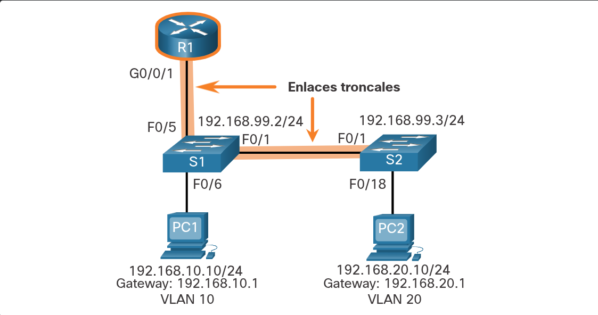
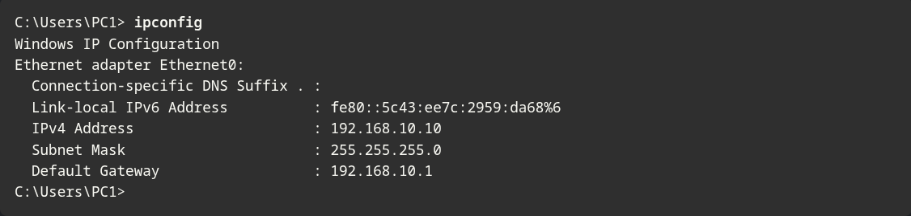

---

### Escenario Router-on-a-Stick

En el tema anterior, se enumeraron tres formas diferentes de crear inter-VLAN routing y se detalló el inter-VLAN routing heredado. Este tema detalla como configurar router-on-a-stick inter-VLAN routing. Puede ver en la figura que el router no está en el centro de la topología, sino que parece estar en un palo cerca del borde, de ahí el nombre.

En la figura, la interfaz R1 GigabitEthernet 0/0/1 está conectada al puerto S1 FastEthernet 0/5. El puerto S1 FastEthernet 0/1 está conectado al puerto S2 FastEthernet 0/1. Estos son enlaces troncales necesarios para reenviar tráfico dentro de las VLAN y entre ellas.


Para enrutar entre VLAN, la interfaz R1 GigabitEthernet 0/0/1 se divide lógicamente en tres subinterfaces, como se muestra en la tabla. La tabla también muestra las tres VLAN que se configurarán en los switches.

### Router R1 Subinterfaces


Suponga que R1, S1 y S2 tienen configuraciones básicas iniciales. Actualmente, PC1 y PC2 no pueden **ping** entre sí porque están en redes separadas. Sólo S1 y S2 pueden **ping** uno al otro, pero son inalcanzables por PC1 o PC2 porque también están en diferentes redes.

Para permitir que los dispositivos se hagan ping entre sí, los switches deben configurarse con VLAN y trunking, y el router debe configurarse para el inter-VLAN routing.

---
### S1 VLAN and configuraciones de enlaces troncales

Complete los siguientes pasos para configurar S1 con VLAN y trunking:

**Paso 1**. Crear y nombrar las VLANs.

**Paso 2**. Crear la interfaz de administración

**Paso 3**. Configurar puertos de acceso.

**Paso 4**. Configurar puertos de enlace troncal.


**1. Crear y nombrar los VLANs.**

En primer lugar, las VLAN se crean y nombran. Las VLAN sólo se crean después de salir del modo de subconfiguración de VLAN.

```
S1(config)# vlan 10
S1(config-vlan)# name LAN10
S1(config-vlan)# exit
S1(config)# vlan 20
S1(config-vlan)# name LAN20
S1(config-vlan)# exit
S1(config)# vlan 99
S1(config-vlan)# name Management
S1(config-vlan)# exit
S1(config)#
```


**2. Crear la interfaz de administración.**

A continuación, se crea la interfaz de administración en VLAN 99 junto con el default gateway de R1.

```
S1(config)# interface vlan 99
S1(config-if)# ip add 192.168.99.2 255.255.255.0
S1(config-if)# no shut
S1(config-if)# exit
S1(config)# ip default-gateway 192.168.99.1
S1(config)#
```

**3. Configurar puertos de acceso.**

A continuación, el puerto Fa0/6 que se conecta a PC1 se configura como un puerto de acceso en la VLAN 10. Supongamos que PC1 se ha configurado con la dirección IP correcta y el default gateway.

```
S1(config)# interface fa0/6
S1(config-if)# switchport mode access
S1(config-if)# switchport access vlan 10
S1(config-if)# no shut
S1(config-if)# exit
S1(config)#
```

**4. Configurar puertos de enlace troncal.**

Por último, los puertos Fa0/1 que se conectan a S2 y Fa0/5 que se conectan a R1 se configuran como puertos troncal.

```
S1(config)# interface fa0/1
S1(config-if)# switchport mode trunk
S1(config-if)# no shut
S1(config-if)# exit
S1(config)# interface fa0/5
S1(config-if)# switchport mode trunk
S1(config-if)# no shut
S1(config-if)# end
*Mar 1 00:23:43.093: %LINEPROTO-5-UPDOWN: Line protocol on Interface FastEthernet0/1, changed state to up
*Mar 1 00:23:44.511: %LINEPROTO-5-UPDOWN: Line protocol on Interface FastEthernet0/5, changed state to up
```

---
### S2 VLAN y configuraciones de enlaces troncales

La configuración para S2 es similar a S1.


---
---

S2(config)# **vlan 10**

S2(config-vlan)# **name LAN10**

S2(config-vlan)# **exit**

S2(config)# **vlan 20**

S2(config-vlan)# **name LAN20**

S2(config-vlan)# **exit**

S2(config)# **vlan 99**

S2(config-vlan)# **name Management**

S2(config-vlan)# **exit**

S2(config)#

S2(config)# **interface vlan 99**

S2(config-if)# **ip add 192.168.99.3 255.255.255.0**

S2(config-if)# **no shut**

S2(config-if)# **exit**

S2(config)# **ip default-gateway 192.168.99.1**

S2(config)# **interface fa0/18**

S2(config-if)# **switchport mode access**

S2(config-if)# **switchport access vlan 20**

S2(config-if)# **no shut**

S2(config-if)# **exit**

S2(config)# **interface fa0/1**

S2(config-if)# **switchport mode trunk**

S2(config-if)# **no shut**

S2(config-if)# **exit**

S2(config-if)# **end**

*Mar  1 00:23:52.137: %LINEPROTO-5-UPDOWN: Line protocol on Interface FastEthernet0/1, changed state to up

---
---
### Configuración de subinterfaces de R1

**Creación:** Para crear una subinterfaz desde el modo de configuración global, se usa la sintaxis `interface [interfaz_física].[ID_subinterfaz]`.

Buena práctica: Aunque no es obligatorio, por costumbre y orden se recomienda que el número de la subinterfaz coincida exactamente con el número de la VLAN.

**Comandos obligatorios:** Cada subinterfaz creada debe configurarse de forma independiente con estos dos comandos:

encapsulation dot1q [vlan_id] [native]: Le indica a la subinterfaz que responda al tráfico etiquetado 802.1Q de esa VLAN específica. La palabra clave `native` **solo** se añade si se quiere configurar una VLAN nativa distinta a la VLAN 1.

ip address [IP] [máscara]: Asigna la dirección IPv4. Esta IP funcionará como el **default gateway** (puerta de enlace predeterminada) para los hosts que pertenezcan a esa VLAN.

_Nota de enrutamiento:_ Cada subinterfaz debe configurarse obligatoriamente en una subred única para que el enrutamiento funcione.

**Activación:** Las subinterfaces no se encienden una por una. Una vez que hayas terminado de configurarlas todas, debes ingresar a la **interfaz física principal** y ejecutar el comando `no shutdown`. Si la interfaz física se deshabilita, todas sus subinterfaces caerán automáticamente.



---
---

R1(config)# **interface G0/0/1.10**

R1(config-subif)# **description Default Gateway for VLAN 10**

R1(config-subif)# **encapsulation dot1Q 10**

R1(config-subif)# **ip add 192.168.10.1 255.255.255.0**

R1(config-subif)# **exit**

R1(config)#

R1(config)# **interface G0/0/1.20**

R1(config-subif)# **description Default Gateway for VLAN 20**

R1(config-subif)# **encapsulation dot1Q 20**

R1(config-subif)# **ip add 192.168.20.1 255.255.255.0**

R1(config-subif)# **exit**

R1(config)#

R1(config)# **interface G0/0/1.99**

R1(config-subif)# **description Default Gateway for VLAN 99**

R1(config-subif)# **encapsulation dot1Q 99**

R1(config-subif)# **ip add 192.168.99.1 255.255.255.0**

R1(config-subif)# **exit**

R1(config)#

R1(config)# **interface G0/0/1**

R1(config-if)# **description Trunk link to S1**

R1(config-if)# **no shut**

R1(config-if)# **end**

R1#

*Sep 15 19:08:47.015: %LINK-3-UPDOWN: Interface GigabitEthernet0/0/1, changed state to down

*Sep 15 19:08:50.071: %LINK-3-UPDOWN: Interface GigabitEthernet0/0/1, changed state to up

*Sep 15 19:08:51.071: %LINEPROTO-5-UPDOWN: Line protocol on Interface GigabitEthernet0/0/1, changed state to up

R1#

---
---
### Verificar la conectividad entre PC1 y PC2

La configuración del router-on-a-stick se completa después de configurar los enlaces troncales del switch y las subinterfaces del router. La configuración se puede verificar desde los hosts, el router y el switch.

Desde un host, compruebe la conectividad con un host de otra VLAN mediante el **ping** comando. Es una buena idea verificar primero la configuración IP del host actual mediante el comando **ipconfig** Windows host



El resultado confirma la dirección IPv4 y el default gateway de PC1. A continuación, utilice **ping** para verificar la conectividad con PC2 y S1, como se muestra en la figura. El **ping** resultado confirma correctamente que el enrutamiento entre VLANs está funcionando.


---
### Verificación de Router-on-a-Stick Inter-VLAN Routing

Además de utilizar **ping** entre dispositivos, se pueden utilizar los siguientes **show** comandos para verificar y solucionar problemas de la configuración del router-on-a-stick.

- **show ip route**
- **show ip interface brief**
- **show interfaces**
- **show interfaces trunk**

---

**Show ip route**

Compruebe que las subinterfaces aparecen en la tabla de enrutamiento de R1 mediante el **show ip route** comando. Observe que hay tres rutas conectadas (C) y sus respectivas interfaces de salida para cada VLAN enrutable. El resultado confirma que las subredes, las VLAN y las subinterfaces correctas están activas.


---

**Show ip interface brief

Otro comando útil del router es **show ip interface brief,** como se muestra en el resultado. El resultado confirma que las subinterfaces tienen configurada la dirección IPv4 correcta y que están operativas.


---

**Show interfaces**

Las subinterfaces se pueden verificar mediante el comando **show interfaces** _subinterface-id_, como se muestra.


---

**Show interfaces trunk**

La configuración incorrecta también podría estar en el puerto troncal del switch. Por lo tanto, también es útil verificar los enlaces troncales activos en un switch de Capa 2 mediante el **show interfaces trunk** comando, como se muestra en el ejemplo. El resultado confirma que el enlace a R1 es troncal para las VLAN requeridas.

**Note:** Aunque la VLAN 1 no se configuró explícitamente, se incluyó automáticamente porque el tráfico de control en los enlaces troncal siempre se reenvía en la VLAN 1.


----

