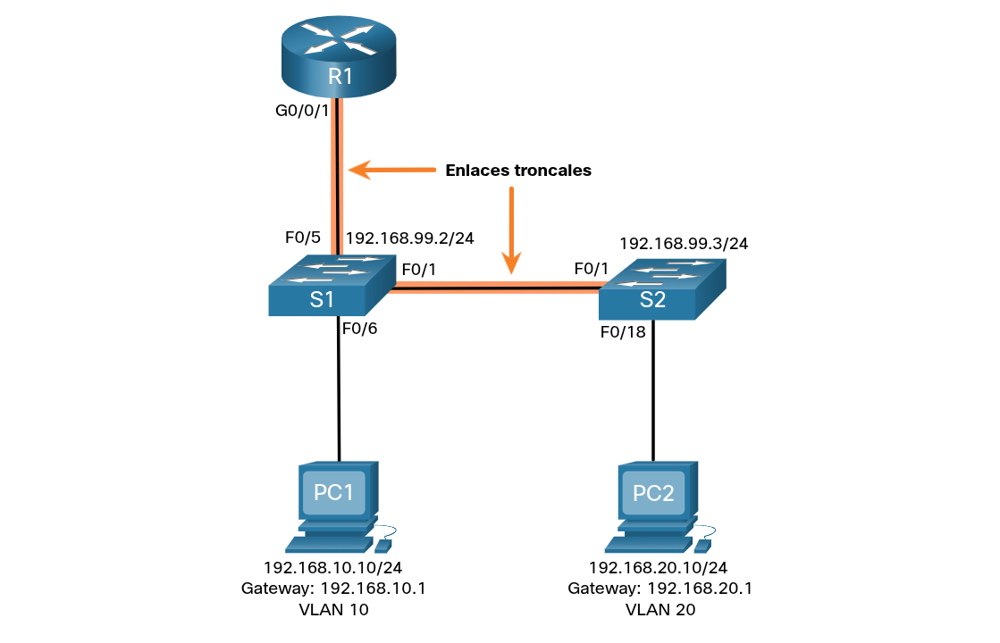
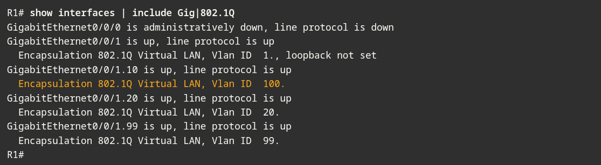
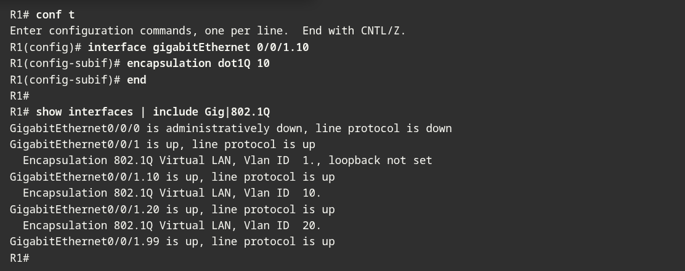

---

### Problemas comunes de Inter-VLAN routing

**Problema principal:** Las fallas en las configuraciones de enrutamiento entre VLANs siempre se traducen en problemas de **conectividad**.

**Primer paso (Capa 1):** Antes de buscar errores lógicos, lo primero que debes hacer es comprobar la **capa física**. Asegúrate de que no haya cables conectados en los puertos incorrectos.

**Segundo paso (Configuración):** Si todas las conexiones físicas son correctas y los cables están donde deben, entonces debes proceder a buscar errores comunes en la configuración lógica de los dispositivos (como asignación de VLANs, enlaces troncales o subinterfaces).

---
### Escenario de resolución de problemas de Inter-VLAN Routing

**Introducción:** Los siguientes temas analizarán con más detalle casos reales de fallas en el enrutamiento entre VLANs.

**Topología base:** Se utilizará una topología de red de referencia para ilustrar y diagnosticar cada uno de estos problemas.

La información de direccionamiento VLAN e IPv4 para R1 se muestra en la tabla.
### Router R1 subinterfaces

### VLAN faltantes

**Causa del problema:** Un fallo de conectividad entre VLANs puede ser ocasionado por la ausencia de una VLAN, ya sea porque nunca se creó, se eliminó por error o no está permitida en un enlace troncal.

**Verificación:** Puedes comprobar el estado actual ejecutando el comando `show vlan brief` para confirmar si la VLAN requerida existe y está activa.

Ahora suponga que la vlan 10 se elimina accidentalmente, como se muestra en el siguiente resultado.

Observe que ahora falta VLAN 10 en el resultado Observe también que el puerto Fa0/6 no se ha reasignado a la VLAN predeterminada. Cuando elimina una VLAN, cualquier puerto asignado a esa VLAN queda inactivo. Permanecen asociados con la VLAN (y, por lo tanto, inactivos) hasta que los asigne a una nueva VLAN o vuelva a crear la VLAN que falta.

Utilice el **show interface** comando **switchport** _interface-id_ para verificar la pertenencia a VLAN.

Si se vuelve a crear la VLAN que falta, se reacignarán automaticamente los hosts a ella, como se muestra en la siguiente imagen.

Si se da cuenta la VLAN no se a creado como se esperaba. Esto pasa porque debe salir del modo de subconfig para poder crear la VLAN correctamente.

Ahora observe que la VLAN está incluida en la lista y que el host conectado a Fa0/6 está en la VLAN 10.

----
### Problema con el puerto troncal del switch

Otro problema para el enrutamiento entre VLAN incluye puertos de switch mal configurados. En una solución interVLAN heredada, esto podría deberse a que el puerto del router de conexión no está asignado a la VLAN correcta.

Sin embargo, con una solución router-on-a-stick, la causa más común es un puerto troncal mal configurado.

Por ejemplo, suponga que PC1 pudo conectarse a hosts de otras VLAN hasta hace poco. Un vistazo rápido a los registros de mantenimiento reveló que recientemente se accedió al switch S1 Capa 2 para el mantenimiento rutinario. Por lo tanto, sospecha que el problema puede estar relacionado con ese switch.

En S1, verifique que el puerto que se conecta a R1 (es decir, F0/5) esté configurado correctamente en el enlace troncal utilizando el comando **show interfaces trunk**.

El puerto Fa0/5 que conecta a R1 falta en el resultado. Verifique la config de la interfaz con el comando **show running-config interface f0/5**.

Como puede ver, el puerto fue apagado accidentalmente. Para correguir el problema, vuelva a habilitar el puerto y verifique el estado del enlace troncal, como se muestra en el ejemplo.

Para reducir el riesgo de una falla en el enlace del switch es que interrumpa el inter-vlan routing, el diseño de red debe contar con enlaces redundantes y rutas alternativas.

---
## Problemas en los puertos de acceso de switch

Cuando sospeche que hay un problema con una configuración del switch, utilice los distintos comandos de verificación para examinar la configuración e identificar el problema.

Supongamos que PC1 tiene la dirección IPv4 correcta y el default gateway, pero no es capaz de **ping** su propio default gateway PC1 se supone que debe estar conectado a un puerto VLAN 10.

Verifique la config del puerto en S1 mediante el comando **show interfaces** comando **switchport** interface-id.

El puerto fa0/6 se ha configurado como un puerto de acceso como se indica en (static access). Sin embargo, parece que no se a configurado para estar en la VLAN 10. Verifique la config de la interfaz.

Asigne el puerto fa0/6 a la VLAN 10 y verifique la asignación del puerto.

PC1 ahora puede comunicarse con hosts en otras VLAN.

---
### Temas de configuración del router

Los problemas de config del router-on-a-stick suelen estar relacionado con configuraciones incorrectas de la subterfaz. Por ejemplo, se configuró una dirección IP incorrecta o se asignó un ID de VLAN incorrecto a la subinterfaz.

Por ejemplo, R1 debería proporcionar inter-VLAN- routing para los usuarios de VLAN 10, 20 y 99. Sin embargo, los usuarios de VLAN 10 no pueden llegar a ninguna otra VLAN.

Verificó el enlace troncal del switch y todo parece estar en orden. Verificar el estatus de las interfaces usando el comando **show ip interface brief**.

A las subinterfaces se les han asignado las direcciones IPv4 correctas y están operativas.

Compruebe en qué VLAN se encuentra cada una de las subinterfaces. Para esto, podemos usar el comando **show interfaces**, pero genera una gran cantidad de resultado adicionales no requeridos. El resultado del comando se puede reducir utilizando filtros de comandos IOS como se muestra en el ejemplo.

Observe que la interfaz G0/0/1.10 se ha asignado incorrectamente a la VLAN 100 en lugar de a la VLAN 10. Esto se confirma mirando la config de la subinterfaz GigabitEthernet R1 0/0/1.10, como se muestra en la imagen.

Para corregir este problema, configure la subinterfaz G0/0/1.10 para que esté en la VLAN correcta mediante el comando **encapsulation dot1q 10** en el modo de config de subinterfaz.

Una vez asignada la subinterfaz a la VLAN correcta, los dispositivos en esa VLAN pueden acceder a ella, y el router puede realizar inter-VLAN routing.

Con la correcta verificación, los problemas de config del router se resuelven rápidamente, lo que permite que el inter-VLAN routing funcione de forma adecuada.

---

