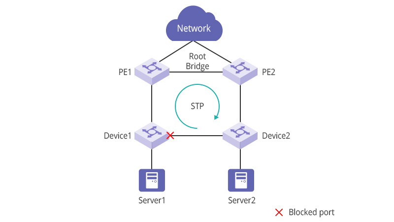

---

### REDUNDANCIA EN REDES CONMUTADAS DE CAPA 2

#### **¿Qué es la redundancia y por qué es importante?**

**Definición:** Es el uso de rutas físicas y lógicas alternativas en la red.

**Propósito:** Forma parte fundamental del diseño de red jerárquico para **eliminar puntos únicos de falla** y evitar que los usuarios pierdan el acceso a los servicios si un cable o enlace falla.

#### **El gran problema: Bucles (Loops)**

Aunque tener caminos alternativos es bueno para la disponibilidad, en las redes Ethernet conmutadas **puede provocar bucles físicos y lógicos en Capa 2**.

**El dilema de Ethernet:** Las LAN Ethernet exigen una topología **sin bucles** (debe existir una sola ruta activa entre cada par de dispositivos).

**Consecuencia de un bucle:** Si se forma uno, las tramas de Ethernet se quedan atrapadas viajando en círculos de forma continua (_broadcast storm_), saturando la red hasta que un enlace físico se rompe o se desconecta manualmente para cortar el ciclo.

_notas:_ **La redundancia salva la red de caídas totales por fallas físicas, pero si no se controla, crea bucles en Capa 2 que destruyen el rendimiento (por eso después se usan protocolos como STP/Árbol de Expansión para solucionarlo).**

----
### PROTOCOLO DE ÁRBOL DE EXPANSIÓN

El protoco de árbol de expansión (STP) es un protocolo de red de prevención de bucles que permite redundancia mientras crea una topología de capa 2 sin bucles. IEEE 802.1D es el estándar original IEEE MAC Bridging para STP.

---
### Problemas con los vínculos de switch redundantes

**Consecuencias de un bucle en Capa 2**

Si hay múltiples rutas en Ethernet y **no se implementa el árbol de expansión (STP)**, se genera un bucle de Capa 2.

Esto provoca tres problemas críticos que vuelven la red inutilizable:

Inestabilidad en la tabla de direcciones MAC.

Saturación de los enlaces.

Alta utilización de CPU tanto en los conmutadores como en los dispositivos finales.

**La gran diferencia entre Capa 2 y Capa 3**

**En Capa 3 (IPv4 / IPv6):** Sí existe un mecanismo para detener bucles. Los routers usan el **TTL (Tiempo de vida)** en IPv4 o el **Límite de saltos** en IPv6; si el contador llega a 0, el paquete se descarta.

**En Capa 2 (Ethernet):** Las tramas **no** traen un mecanismo nativo para contar o eliminar bucles sin fin. Los switches retransmiten las tramas indefinidamente.

**La solución:** Por esta razón se creó específicamente **STP (Spanning Tree Protocol)**, para actuar como mecanismo de prevención de bucles en las redes Ethernet de Capa 2.

---
### BUCLES DE LA CAPA 2

#### **Efecto de los bucles sin STP**

Sin STP habilitado, las tramas de difusión, multidifusión y unidifusión desconocidas se reproducen sin fin.

Esto puede derribar una red en muy poco tiempo, a veces en pocos segundos.

**Ejemplo con difusión (Broadcast):** Una solicitud ARP se reenvía a todos los puertos del conmutador (excepto al de entrada) para que todo el dominio de difusión la reciba; si hay más de una ruta, se forma un bucle infinito.

#### **Impacto en el Switch**

**Inestabilidad en la base de datos MAC:** La tabla de direcciones MAC cambia constantemente debido a las actualizaciones de las tramas en bucle.

**Alta utilización de CPU:** Esto provoca que el switch se quede sin capacidad para seguir reenviando tramas.
#### **Tramas de unidifusión desconocidas**

No solo afectan las tramas de difusión; si se envían tramas de unidifusión desconocidas, pueden llegar copias duplicadas al dispositivo de destino.

Una trama de unidifusión es "desconocida" cuando el switch no tiene la dirección MAC de destino en su tabla y se ve obligado a reenviarla por todos los puertos (excepto el de ingreso).

---
### TORMENTA DE DIFUSIÓN 

#### **¿Qué es una tormenta de difusión?**

Es un número anormalmente alto de emisiones que abruman la red en un período específico de tiempo.

Pueden deshabilitar una red en cuestión de segundos al saturar los switches y dispositivos finales.

**Causas principales:**

Un problema de hardware (como una tarjeta de red o NIC defectuosa).

Un bucle de Capa 2 en la red.

#### **Comportamiento en la red**

Las emisiones de Capa 2 (como solicitudes ARP) y la **multidifusión** (que los switches reenvían igual que una difusión, utilizada por ejemplo por ICMPv6 Neighbor Discovery) provocan consecuencias inmediatas y de desactivación si hay un bucle.

Un host atrapado en un bucle deja de estar accesible para otros.

Al corromperse la tabla de direcciones MAC por los constantes cambios, el switch no sabe por qué puerto reenviar las tramas de unidifusión, repitiéndolas en bucle hasta generar la tormenta.

#### **La solución (Spanning Tree)**

Para evitar estos problemas en redes redundantes, se debe habilitar algún tipo de **árbol de expansión (STP)** en los switches.

_Dato clave:_ De manera predeterminada, **el árbol de expansión viene habilitado en los switches Cisco** para prevenir automáticamente los bucles de Capa 2.

---
### EL ALGORITMO DE ÁRBOL DE EXPANSIÓN 

#### **Origen e Historia**

**Creador:** Se basa en un algoritmo inventado por **Radia Perlman** mientras trabajaba para _Digital Equipment Corporation_.

**Publicación:** Fue dado a conocer en un artículo de 1985 titulado _"Un algoritmo para la computación distribuida de un árbol de expansión en una LAN extendida"_.

#### **¿Cómo funciona el STA (Spanning Tree Algorithm)?**

Crea una topología sin bucles seleccionando un **único puente raíz** (_Root Bridge_).

A partir de ahí, todos los demás conmutadores determinan una **única ruta de menor costo** hacia la raíz.

Sin este protocolo de prevención, se producirían bucles que harían inoperable cualquier red con conmutadores redundantes.

#### **Control de puertos y tolerancia a fallas**

**Puertos en estado de bloqueo:** STP bloquea estratégicamente puertos específicos para cortar las rutas que forman bucles.

**Respuesta ante caídas:** Si ocurre una falla en la red, los switches que ejecutan STP pueden **desbloquear dinámicamente** esos puertos para permitir que el tráfico fluya por las rutas alternativas de respaldo.

---

### Topología de la situación

Este escenario STA utiliza una LAN Ethernet con conexiones redundantes entre varios conmutadores.

---
### Seleccionar el Root Bridge

El algoritmo de árbol de expansión comienza seleccionando un único puente raíz. La figura muestra que el switch S1 se ha seleccionado como puente raíz. En esta topología, todos los enlaces tienen el mismo costo (mismo ancho de banda). Cada switch determinará una única ruta de menor costo desde sí mismo hasta el puente raíz.

**Nota:** STA y STP se refieren a conmutadores como puentes. Esto se debe a que en los primeros días de Ethernet, los switches se denominaban puentes.

---
### Bloquear rutas redundantes

STP asegura que solo haya una ruta lógica entre todos los destinos en la red al bloquear intencionalmente las rutas redundantes que podrían causar un bucle, como se muestra en la figura. Cuando se bloquea un puerto, se impide que los datos del usuario entren o salgan de ese puerto. El bloqueo de las rutas redundantes es fundamental para evitar bucles en la red.

---
### Topología sin bucle

Un puerto bloqueado tiene el efecto de convertir ese enlace en un vínculo no reenvío entre los dos switches, como se muestra en la figura. Observe que esto crea una topología en la que cada conmutador tiene una única ruta al puente raíz, similar a las ramas de un árbol que se conectan a la raíz del árbol.

---
### Fallos de enlace causan recálculo

Las rutas físicas aún existen para proporcionar la redundancia, pero las mismas se deshabilitan para evitar que se generen bucles. Si alguna vez la ruta es necesaria para compensar la falla de un cable de red o de un switch, STP vuelve a calcular las rutas y desbloquea los puertos necesarios para permitir que la ruta redundante se active. Los recálculos STP también pueden ocurrir cada vez que se agrega un nuevo conmutador o un nuevo vínculo entre switches a la red.

La figura muestra un error de enlace entre los conmutadores S2 y S4 que hace que STP se vuelva a calcular. Observe que el vínculo anteriormente redundante entre S4 y S5 se está reenviando para compensar este error. Todavía hay solo una ruta entre cada switch y el puente raíz.

---

