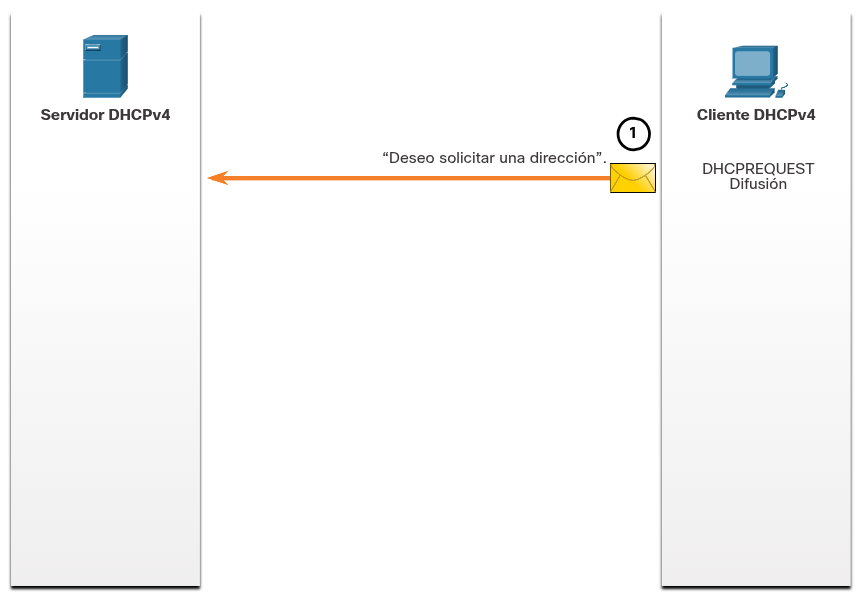
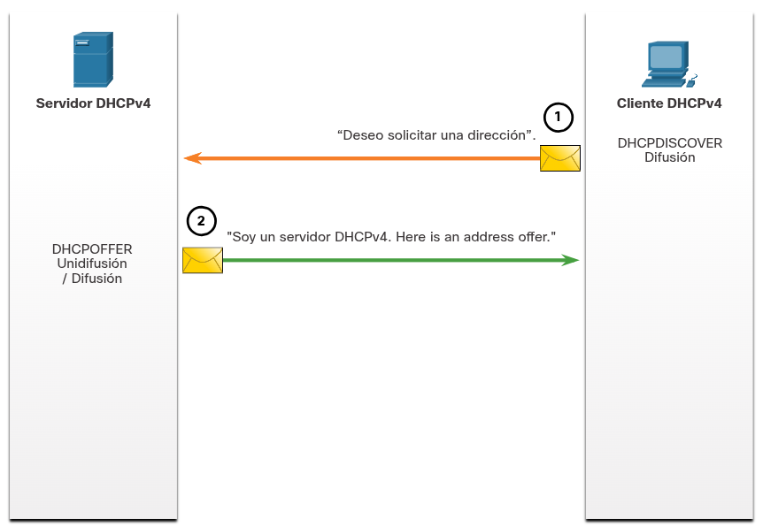
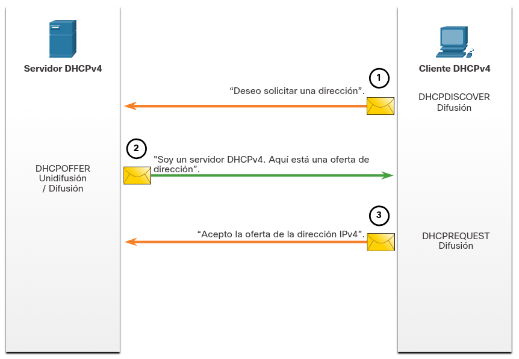
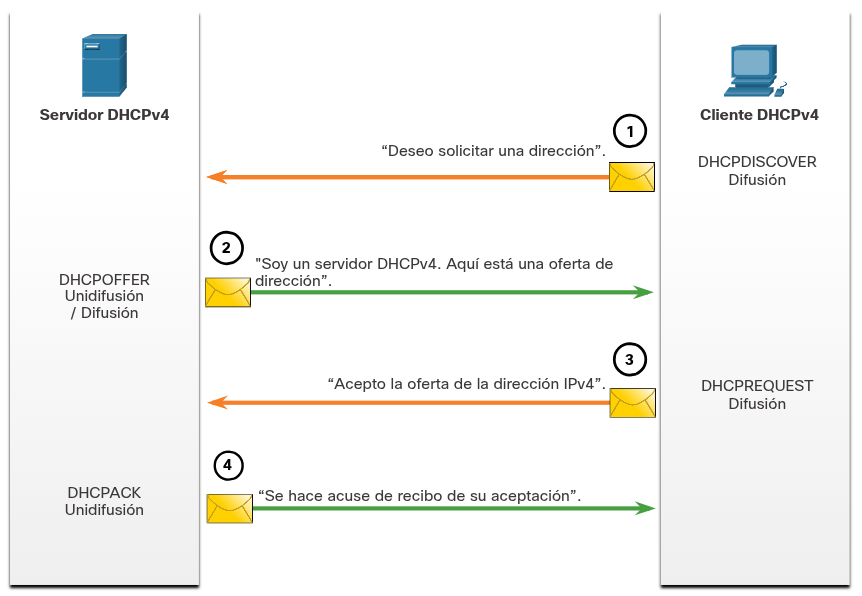

---

### **Servidor y cliente DHCPv4**

**¿Qué es DHCPv4?:** El _Dynamic Host Configuration Protocol v4_ asigna direcciones IPv4 y parámetros de configuración de red de forma dinámica, ahorrando mucho tiempo a los administradores de red debido al gran volumen de clientes de escritorio.

**Implementación:**

Un servidor DHCPv4 dedicado es escalable y fácil de administrar.

En ubicaciones pequeñas o SOHO, se puede configurar un router Cisco (con funciones completas opcionales en su software Cisco IOS) para actuar como servidor DHCPv4 sin necesidad de un equipo dedicado.

**Asignación y Arrendamiento (Lease):** El servidor asigna o arrienda temporalmente una dirección IPv4 de un conjunto (_pool_) por un período limitado o hasta que el cliente ya no la necesite.

**Duración y Renovación:** Los arrendamientos se configuran administrativamente para durar típicamente de 24 horas a una semana o más. Al caducar, el cliente debe solicitar otra dirección (aunque por lo general se le vuelve a asignar la misma).

---
### FUNCIONAMIENTO DHCPv4

DHCPv4 opera bajo una arquitectura cliente/servidor en la que el servidor otorga a cada cliente una dirección IPv4 temporal en calidad de arrendamiento (_lease_) para su conexión a la red. El equipo utiliza dicha dirección hasta que vence el plazo acordado, viéndose obligado a comunicarse periódicamente con el servidor si desea extender el tiempo de uso, lo cual evita que dispositivos desconectados o trasladados sigan reteniendo IPs innecesariamente; una vez expirado el arrendamiento, la dirección regresa al conjunto (_pool_) central para quedar disponible y ser reasignada a otro equipo que lo requiera.

---
### PASOS PARA OBTENER UN ARRENDAMIENTO

**Paso 1. Detección DHCP (DHCPDISCOVER)**

El cliente comienza el proceso enviando una trama de difusión llamada **DHCPDISCOVER**, la cual incluye su propia dirección MAC con el fin de localizar servidores DHCPv4 disponibles en la red.

Como el dispositivo carece de una configuración IP válida durante el arranque, se ve obligado a utilizar direcciones de difusión tanto a nivel de capa 2 como de capa 3 para lograr la comunicación inicial.

La función principal de este mensaje es simplemente descubrir la presencia de servidores de configuración en el entorno de red.

---

**Paso 2. Ofrecimiento de DHCP (DHCPOFFER)**

Al recibir el requerimiento inicial, el servidor DHCPv4 aparta una dirección IPv4 libre para entregársela al cliente en calidad de arrendamiento.

Asimismo, genera un registro ARP provisional combinando la dirección MAC del equipo solicitante con la IP que se le va a asignar.

Finalmente, el servidor responde emitiendo un mensaje **DHCPOFFER** dirigido al cliente que hizo la petición.

---

**Paso 3. Solicitud de DHCP (DHCPREQUEST)**

Cuando el cliente procesa la oferta del servidor, emite una respuesta formal mediante un mensaje **DHCPREQUEST**, el cual se emplea tanto para obtener la IP por primera vez como para prorrogar un arrendamiento existente.

En la fase inicial, este mensaje actúa como una aceptación vinculante hacia el servidor elegido y, al mismo tiempo, como un rechazo implícito para el resto de los servidores que hayan enviado ofertas.

Puesto que es habitual la presencia de múltiples servidores DHCPv4 en entornos empresariales, dicho mensaje se transmite en forma de difusión para enterar a todos los servidores acerca de la oferta que fue seleccionada.

---

**Paso 4. Confirmación de DHCP (DHCPACK)**

Al recibir la solicitud, el servidor valida el estado de la dirección ejecutando un ping ICMP para verificar que no esté ocupada, genera una nueva entrada ARP y emite de vuelta un mensaje de confirmación **DHCPACK** (el cual es prácticamente idéntico al DHCPOFFER, cambiando únicamente el tipo de mensaje).

Al recibir dicha confirmación, el cliente almacena los parámetros de red obtenidos y efectúa una consulta ARP propia sobre la dirección asignada.

Si ningún equipo responde a dicha consulta ARP, el cliente comprueba que la dirección IPv4 se encuentra libre y procede a utilizarla oficialmente como suya.

---
### Pasos para renovar un contrato de arrendamiento

**Inicio de renovación:** Antes de que expire la concesión, el cliente inicia un proceso de dos pasos para renovarla con el servidor DHCPv4.

**1. Detección DHCP (DHCPREQUEST):**

El cliente envía un mensaje `DHCPREQUEST` directamente al servidor DHCPv4 que le otorgó la dirección IPv4 originalmente.

Si pasa un tiempo especificado sin recibir un mensaje `DHCPACK`, el cliente transmite otro `DHCPREQUEST` para que cualquier otro servidor DHCPv4 pueda extender el arrendamiento.

**2. Ofrecimiento de DHCP (DHCPACK):**

Al recibir el mensaje `DHCPREQUEST`, el servidor verifica la información del arrendamiento y responde devolviendo un `DHCPACK`.

**Nota importante:** Ciertos mensajes, principalmente `DHCPOFFER` y `DHCPACK`, pueden enviarse como unidifusión o difusión según la norma IETF RFC 2131.

---

