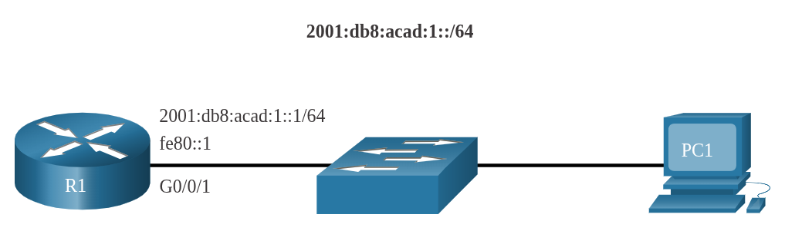
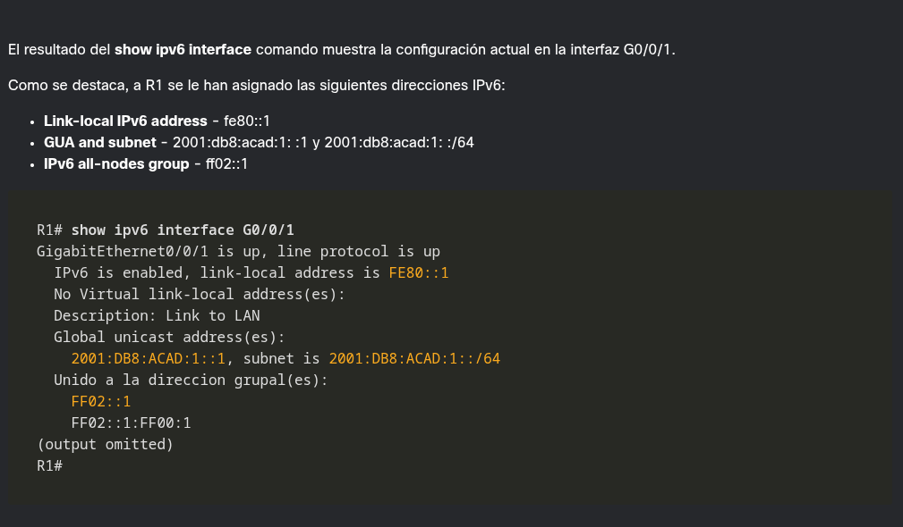
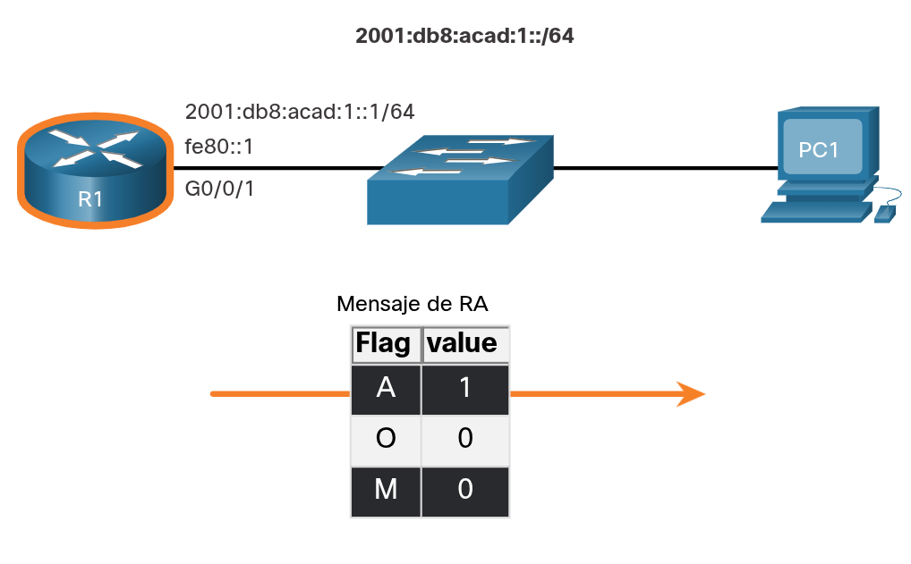

---
### **Descripción general de SLAAC**

**Propósito:** Permite a los hosts crear su propia dirección GUA IPv6 sin necesidad de un servidor DHCPv6.

**Naturaleza (_Stateless_):** No existe un servidor que controle las direcciones IP utilizadas y disponibles.

**Funcionamiento:** Emplea mensajes ICMPv6 RA (enviados por el router cada 200 segundos) y mensajes de solicitud RS emitidos por el host.

**Implementación:** Puede configurarse de forma exclusiva (SLAAC solamente) o combinada con DHCPv6.

---
### ACTIVACIÓN DE SLAAC

Consulte la siguiente topología para ver cómo está habilitado SLAAC.

**VERIFICAR DIRECCIONES IPv6**

**HABILITAR ENRUTAMIENTO IPv6**

**VERIFICAR QUE SLAAC ESTÉ HABILITADO**

---
### **Método Sólo SLAAC**

**Activación predeterminada:** Se activa por defecto al configurar el comando `ipv6 unicast-routing`. Las interfaces Ethernet con una GUA IPv6 configurada empiezan a emitir mensajes RA con el indicador A en 1 y los indicadores O y M en 0.

**Función del indicador A ($A = 1$):** Le sugiere al cliente que genere su propia GUA IPv6 empleando el prefijo difundido en el mensaje RA. Para el ID de interfaz, el dispositivo puede optar por el estándar EUI-64 o permitir que se cree de forma aleatoria.

**Función de los indicadores O y M ($O = 0$ y $M = 0$):** Le señalan al equipo que debe aprovechar únicamente los datos provistos en el mensaje RA, los cuales abarcan el prefijo, su longitud, la puerta de enlace predeterminada, la MTU y el servidor DNS, descartando la intervención de un servidor DHCPv6.

En el ejemplo, PC1 esta habilitada para obtener su información de dirección de IPv6 de forma automática. Debido a la config de los flags A, O y M, PC1 sólo realiza SLAAC, utilizando la información contenida en el mensaje RA enviado por R1. 

La dirreción del default gateway es la dirección IPv6 de origen del mensaje RA, que es la LLA para R1. En default gateway solo se puede obtener de forma automática mediante un mensaje RA. Un servidor DHCPv6 no proporciona esta información.

---
### ICMPv6 RS Messages

Un router envía mensajes de RA cada 200 seg. Sin embargo, también enviará un mensaje RA si recibe un mensaje RS de un host.

Cuando un cliente está configurado para obtener su información de direccionamiento automáticamente, envía un mensaje RS a la dirección de multidifusión IPv6 de FF02::2.

La imagen muestra cómo un host inicial del método SLAAC.

---
### **Proceso de host para generar ID de interfaz**

Mediante SLAAC, un host adquiere los 64 bits de subred IPv6 del mensaje RA, pero debe generar el identificador de interfaz (ID) de 64 bits restante empleando uno de dos métodos.

**De generación aleatoria:** El ID de interfaz de 64 bits es creado de forma aleatoria por el sistema operativo del cliente, siendo este el método utilizado actualmente por los hosts de Windows 10.

**EUI-64:** El host crea el ID de interfaz utilizando su dirección MAC de 48 bits e insertando el valor hexadecimal `fffe` en el medio.

**Consideración de privacidad:** Ciertos sistemas operativos emplean por defecto el ID aleatorio en lugar de EUI-64 debido a problemas de privacidad, ya que EUI-64 expone la dirección MAC física de la tarjeta.

**Nota de soporte:** Sistemas operativos como Windows, Linux y Mac OS permiten al usuario configurar si prefieren generar el ID de interfaz de forma aleatoria o utilizar EUI-64.

**Ejemplo práctico:** El resultado de `ipconfig` de un host PC1 muestra cómo se combinó la información de subred del RA de R1 con un ID de interfaz de 64 bits generado aleatoriamente.

----
### **Detección de direcciones duplicadas**

El proceso permite al host crear una dirección IPv6, sin embargo, no hay garantía de que la dirección sea única en la red.

Ya que SLAAC es _stateless_, un host tiene la opción de verificar que una dirección IPv6 recién creada sea única antes de que pueda usarse.

Un host utiliza el proceso de detección de direcciones duplicadas (DAD) para asegurarse de que IPv6 GUA es único.

DAD se implementa usando ICMPv6.

Para realizar DAD, el host envía un mensaje ICMPv6 NS con una dirección de multidifusión especialmente construida, llamada dirección de multidifusión de nodo solicitado, la cual duplica los últimos 24 bits de dirección IPv6 del host.

Si ningún otro dispositivo responde con un mensaje NA, prácticamente se garantiza que la dirección es única y puede ser utilizada por la PC.

Si un mensaje NA es recibido por el host, la dirección no es única, y el sistema operativo debe determinar una nueva ID de interfaz para utilizar.
 
La Internet Engineering Task Force (IETF) recomienda que DAD se utilice en todas las direcciones de unidifusión IPv6 independientemente de si se crea con SLAAC sólo, se obtiene con DHCPv6 _stateful_, o se configura manualmente.

DAD no es obligatorio porque un ID de interfaz de 64 bits proporciona 18 quintillion de posibilidades y la posibilidad de que haya una duplicación es remota.

La mayoría de los sistemas operativos realizan DAD en todas las direcciones de unidifusión IPv6, independientemente de cómo se configure la dirección.

---

