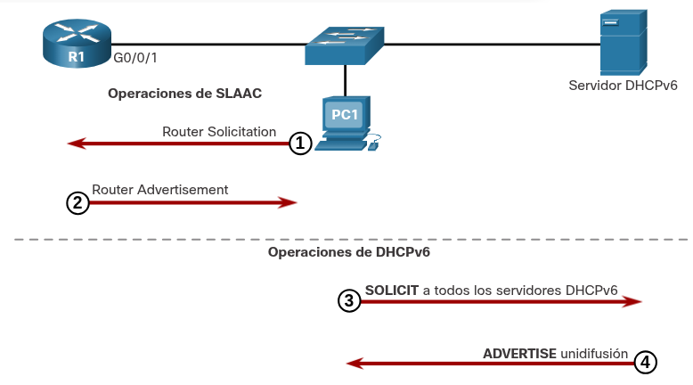
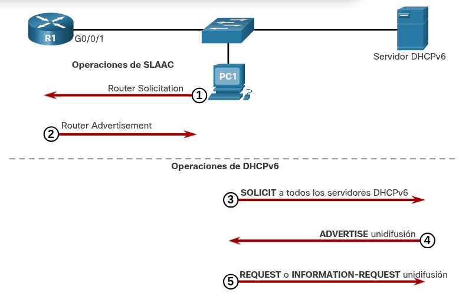
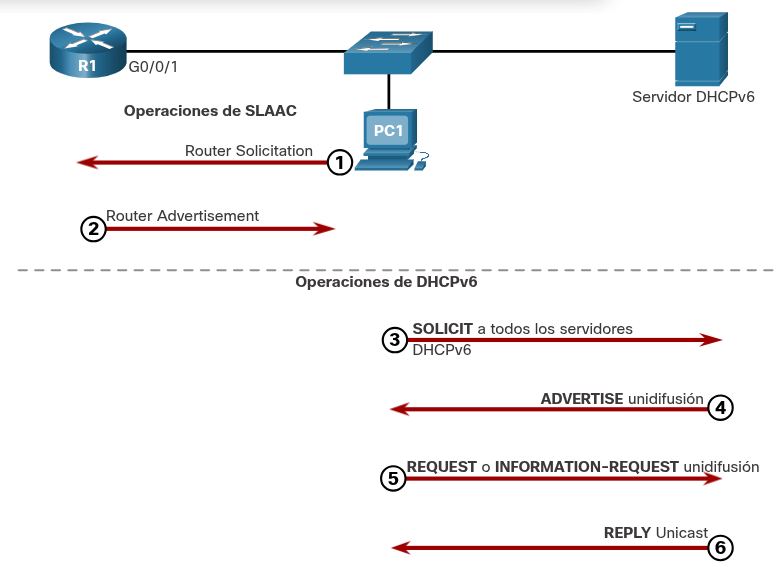

---

### **Pasos de operación DHCPv6**

**Enfoques del protocolo:** El apartado aborda tanto las variantes _stateless_ como _stateful_ de DHCPv6, aclarando que la versión sin estado se apoya en fragmentos de SLAAC para garantizar la entrega de toda la información requerida al host, mientras que la modalidad con estado opera de manera independiente de SLAAC.

**Relación con IPv4:** A pesar de guardar ciertas similitudes funcionales con DHCPv4 debido al servicio que prestan, ambos protocolos operan de forma totalmente autónoma.

**Inicio de la comunicación:** El intercambio de mensajes entre cliente y servidor DHCPv6 arranca en el momento en que un mensaje RA especifica el uso de DHCPv6 _stateless_ o _stateful_.

**Control de puertos UDP:** Las comunicaciones dirigidas desde el servidor hacia el cliente emplean el puerto de destino UDP 546, en tanto que las solicitudes enviadas desde el cliente hacia el servidor utilizan el puerto de destino UDP 547.

**Paso 1. El host envía un mensaje RS.**

PC1 envía un mensaje RS a todos los routers habilitados para IPv6.

**Paso 2. Router responde con un mensaje RA**

R1 recibe el RS y responde con un RA indicando que el cliente debe iniciar la comunicación con un servidor DHCPv6.

**Paso 3. El host envía un mensaje DHCPv6 SOLIT**

El cliente, ahora un cliente DHCPv6, necesita localizar un servidor DHCPv6 y envía un mensaje DHCPv6 SOLICIT a la dirección reserada de todos los servidores DHCPv6 de multidifusión IPv6 de ff02::1:2. Esta dirección de multidifusión tiene alcance link-local, lo cual significa que los routers no reenvíar los mensajes a otras redes.

**Paso 4. El servidor DHCPv6 responde con un mensaje ADVERTISE**

Uno o más servidores DHCPv6 responden con un mensaje unidifusión DHCPv6 ADVERTISE. El mensaje ADVERTISE le informa al cliente DHCPv6 que el servidor se encuentra disponible para el servicio DHCPv6.

**Paso 5. El host responde al servidor DHCPv6**

La respuesta PC1 depende de si está utilizando DHCPv6 stateful o stateless:

**A)  Cliente DHCPv6 Stateless -** El cliente crea una dirección IPv6 utilizando el prefijo en el mensaje RA y una ID de interfaz autogenerada. El cliente envía un mensaje DHCPv6 INFORMATION - REQUEST al servidor de DHCPv6 en el que solicita solamente parámetros de config, como la dirección del servidor DNS.

**B) Cliente DHCPv6 Stateful -** El Cliente envía un mensaje DHCPv6 REQUEST al servidor para obtener una dirección IPv6 y todos los demás parámetros de config del servidor.

**Paso 6. El servidor DHCPv6 envía un mensaje REPLY**

El servidor envía un mensaje de unidifusión DHCPv6 REPLY al cliente. El contenido del mensaje varía en función de si responde a un mensaje REQUEST o INFORMATION-REQUEST.

**Nota:** El cliente usara la dirección IPv6 link-local de origen del RA como su dirección default gateway. Un servidor DHCPv6 no proporciona esta información.

---
### **Pasos de operación DHCPv6**

**Enfoques del protocolo:** El apartado aborda tanto las variantes _stateless_ como _stateful_ de DHCPv6, aclarando que la versión sin estado se apoya en fragmentos de SLAAC para garantizar la entrega de toda la información requerida al host, mientras que la modalidad con estado opera de manera independiente de SLAAC.

**Relación con IPv4:** A pesar de guardar ciertas similitudes funcionales con DHCPv4 debido al servicio que prestan, ambos protocolos operan de forma totalmente autónoma.

**Inicio de la comunicación:** El intercambio de mensajes entre cliente y servidor DHCPv6 arranca en el momento en que un mensaje RA especifica el uso de DHCPv6 _stateless_ o _stateful_.

**Control de puertos UDP:** Las comunicaciones dirigidas desde el servidor hacia el cliente emplean el puerto de destino UDP 546, en tanto que las solicitudes enviadas desde el cliente hacia el servidor utilizan el puerto de destino UDP 547.

**Operación DHCP stateless**

---
### HABILITAR DHCPv6 STATELESS EN UNA INTERFAZ

DHCPv6 Stateless está habilitado en una interfaz de router mediante el comando **ipv6 nd other-config flag**  interface configuration. Esto establece el flag O en 1.

El resultado resaltado confirma que la RA le indicará a los hosts receptores que usen la config auto stateless (A flag = 1 ) y se comunique con un servidor DHCPv6 para obtener otra información de config (O flag = 1).

**OJO:** Puede usar el comando **no ipv6 nd other-config flag para restablecer la interfaz a la opción predeterminada de SLAAC sólo ( O flag = 0 ).

---
## Operaciones de DHCPv6 stateful

Esta opción es la más similar a DHCPv4. En este caso, el mensaje RA indica al cliente que obtenga toda la información de direccionamiento de un servidor DHCPv6 stateful, excepto la dirección del default gateway que es la dirección link-local IPv6 de origen de la RA.

Esto se conoce como DHCPv6 stateful, debido a que el servidor de DHCPv6 mantiene información de estado de IPv6. Esto es similar a la asignación de direcciones para IPv4 por parte de un servidor de DHCPv4.

La figura ilustra la operación DHCPv6 stateful.

**NOTA:** Si A = 1 y M =1, algunos sistemas operativos como Windows crearán una dirección IPv6 mediante SLAAC y obtendrán una dirección diferente del servidor DHCPv6 stateful. En la mayoría de los casos, se recomienda establecer manualmente el flag A en 0.

---
## Habilitar DHCPv6 stateful en una interfaz

DHCPv6 Stateful es habilitado en una interfaz de router mediante el comando **ipv6 nd managed-config-flag** interface configuration Esto establece el flag M en 1.

El resultado resaltado en el ejemplo confirma que RA indicará al host que obtenga toda la información de configuración IPv6 de un servidor DHCPv6 (flag M = 1).

----
